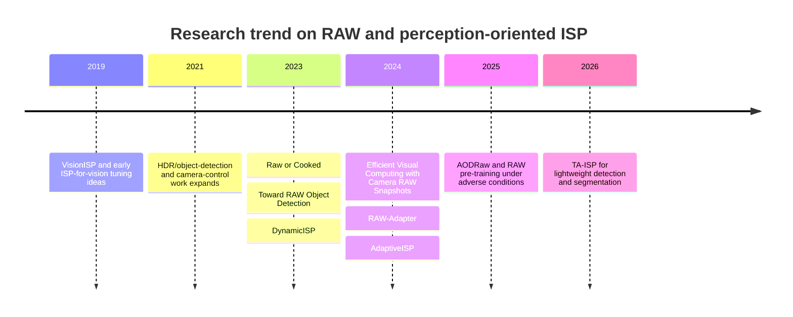

# RAW and Sensor-Native Inputs for Perception

## Executive summary

The strongest conclusion from the literature is not that **“RAW always beats sRGB”**, but that **sensor-native data helps when the pipeline is task-aware**. Across object detection and segmentation papers, **naively feeding RAW to a network often hurts badly**, while **RAW plus modest learned adaptation or a task-aware ISP usually improves over standard ISP-processed sRGB**, with the largest gains appearing in **low light, HDR, glare, rain, fog, and sensor-mismatch settings**. The most robust papers show improvements ranging from **about +0.8 AP to +6.6 AP** in detection and **about +3.1 to +7.0 mIoU** in segmentation under matched or paired evaluations; the counterexamples show that **unadapted RAW can be worse by double-digit AP**. citeturn22view3turn28view3turn32view0turn35view0turn37view6turn37view7turn39view5turn39view6turn32view1

A second consistent finding is that **pretraining and domain gap dominate outcomes**. Several recent works explicitly show that **sRGB pretraining transferred to RAW is suboptimal**, yet **training from scratch on limited RAW data is also weak**. The best recent results tend to use one of three strategies: **learned RAW-domain adaptation/ISP**, **RAW-specific pretraining**, or **RGB-to-RAW synthesis plus few-shot real-RAW tuning**. citeturn33view0turn37view1turn32view0

Industry and patent evidence points in the same direction. Google, Apple, Qualcomm, Sony, and OmniVision all expose some version of the same design idea: **the sensor output used for human viewing should not be assumed optimal for machine perception**. Official sources discuss **computational RAW**, **scene-referred partially processed RAW**, **simultaneous RAW and YUV output**, **human-vision versus computer-vision ISP settings**, and **feeding raw/statistics streams to non-display modules**. Public evidence from Tesla and Mobileye is much thinner on ISP specifics; the sources reviewed here show strong downstream vision emphasis, but not a public, primary-source statement that their production perception stack ingests camera RAW directly. citeturn9search0turn9search4turn17search0turn17search4turn17search7turn16view0turn10search1turn24search9turn8search6turn8search12turn13search2turn15view1turn14view3

For engineers, the practical implication is clear: do **not** frame the design question as **RAW versus sRGB** in the abstract. Frame it as **which sensor-native information should be preserved, how much should be normalized, and how should uncertainty be exposed to the DNN**. The best current evidence supports a **dual-stream or multi-output ISP**: one output for viewing/logging, one output for perception, plus auxiliary maps such as **noise/SNR, saturation/HDR source, demosaic confidence, lens gain, and temporal/flicker confidence**. citeturn16view0turn10search1turn8search6turn8search12turn39view5turn39view6

## Evidence from academic literature

The timeline below captures how the field evolved from **“can RAW help at all?”** to **“how do we adapt pretrained models and build task-aware ISPs efficiently?”**. The 2023 papers established the problem, the 2024 papers clarified the role of pretraining and adaptation, and the 2025–2026 papers pushed toward broader adverse-condition benchmarks and lightweight perception-oriented ISP designs. citeturn20view0turn26view0turn29view0turn33view0turn36view0turn38view2



### Comparative paper survey

| Year | Venue | Paper | Dataset / Task | Input type and method | Model / setup | Quantitative delta vs standard ISP sRGB or closest baseline | Takeaway |
|---|---|---|---|---|---|---|---|
| 2023 | SCIA | **Raw or Cooked? Object Detection on RAW Images** citeturn20view0turn22view3 | PASCALRAW; object detection | Standard RGB baseline versus RAW RGGB, plus lightweight learned transforms on RAW | Faster R-CNN + FPN + ResNet-50; RGB made from RAW via RawPy ISP citeturn22view3 | RGB baseline **50.5 AP**; naive RAW **31.3 AP**; RAW + learnable gamma **51.4 AP**; RAW + learnable Yeo–Johnson **52.6 AP**. That is **+2.1 AP over RGB**, but **−19.2 AP** for naive RAW. citeturn22view3 | Excellent evidence that **RAW alone is not enough**; a small task-aware transform is enough to beat sRGB on this daylight dataset. |
| 2023 | CVPR | **Toward RAW Object Detection: A New Benchmark and a New Model** citeturn26view0turn27view0 | ROD; HDR driving detection | SDR versus HDR RAW at 10/12/24-bit; proposed RAW dynamic-range adjustment jointly learned with detector | YOLOX variants and other detectors on paired RAW/SDR benchmark citeturn27view0turn28view3 | On 24-bit data, SDR gives **52.1 / 63.3 / 69.7 AP** across three model sizes, naive RAW drops to **34.6 / 43.9 / 47.5 AP**, and the proposed method rises to **58.7 / 67.8 / 75.5 AP**. The paper also states the method exceeds SDR by **6.6% AP** on day and **3.9% AP** on night in one day/night setting. citeturn28view3turn28view4 | Strong evidence that **HDR RAW is valuable but unusable without dynamic-range adaptation**. |
| 2023 | ICCV | **DynamicISP: Dynamically Controlled Image Signal Processor for Image Recognition** citeturn24search0turn24search3 | Image recognition / detection-oriented ISP tuning | Not a pure RAW-vs-sRGB paper; dynamically tunes classical ISP parameters for recognition | Sony; low-cost dynamic ISP control using recognition feedback citeturn24search0turn24search3 | Public abstract states SOTA accuracy with low compute, but the paper focuses more on **adaptive ISP control** than a direct RAW-vs-sRGB ablation. citeturn24search3 | Important architecturally: shows industry-grade interest in **perception-driven ISP tuning** even without fully neural ISP. |
| 2024 | TPAMI | **Efficient Visual Computing With Camera RAW Snapshots** citeturn23search19turn29view0 | MultiRAW; object detection and semantic segmentation on real RAW | Generate simRAW from RGB, train RAW-domain downstream models, then optionally few-shot tune on real RAW | Detection: YOLOv3 + MobileNetV2; Segmentation: HRNetv2. Real iPhone RAW test set with paired iPhone ISP RGB comparisons. citeturn32view0turn32view1 | Detection on real iPhone RAW: best prior raw adaptation **53.7 AP**, paired RGB baseline **55.6 AP**, proposed method **59.1 AP**. Segmentation on real iPhone RAW: paired RGB baseline **47.5 mIoU**, best prior raw method **43.6 mIoU**, proposed method **50.6 mIoU**. Naive RAW segmentation baseline is only **11.1 mIoU**. citeturn32view0turn32view1 | One of the strongest practical papers: shows **real RAW evaluation**, **paired RGB comparison**, and **cross-task gains**. |
| 2024 | ECCV | **RAW-Adapter: Adapting Pre-trained Visual Model to Camera RAW Images** citeturn33view0 | PASCALRAW, LOD, ADE20K-RAW; detection and segmentation | sRGB-pretrained backbones adapted to RAW with input-level and model-level adapters | Detection: RetinaNet / Sparse R-CNN; Segmentation: SegFormer with MIT backbones citeturn34view0turn35view0turn35view2 | PASCALRAW, ResNet-50, dark: demosaicing **82.6 mAP**, Dirty-Pixel **83.6**, RAW-Adapter **86.6**. LOD, RetinaNet: Dirty-Pixel **61.6**, RAW-Adapter **62.2**; Sparse R-CNN: **58.8** to **59.2**. ADE20K-RAW dark mIoU: Dirty-Pixel MIT-B5 **40.02**, RAW-Adapter MIT-B5 **41.82**. citeturn35view0turn35view2 | Best evidence that **pretrained-model adaptation matters** and that lightweight adapter-style designs can outperform both fixed ISP and heavier learned ISP pipelines. |
| 2024 | NeurIPS | **AdaptiveISP: Learning an Adaptive Image Signal Processor for Object Detection** citeturn24search1turn24search7 | Detection with adaptive ISP; multi-detector evaluation | Scene-adaptive ISP via reinforcement learning; more perception-ISP than pure RAW-vs-sRGB | Paper text shows improved transfer to YOLOv3, YOLOX, DDQ beyond RGB baseline citeturn39view4 | Cross-detector test reports RGB baseline to AdaptiveISP gains of **37.4 → 47.1**, **39.2 → 47.2**, and **35.9 → 52.0 mAP@0.5:0.95** for YOLOv3, YOLOX, and DDQ, respectively. Parsing of dataset context is imperfect in the extracted PDF text, so treat these as strong but not fully standardized against the rest of this table. citeturn39view4 | Valuable evidence that **adaptive ISP policies** can yield large downstream gains, though this paper is not a clean, paired RAW-vs-sRGB benchmark in the same sense as ROD or AODRaw. |
| 2025 | CVPR | **Towards RAW Object Detection in Diverse Conditions** citeturn36view0 | AODRaw; adverse-condition detection | RAW and sRGB benchmark; evaluates domain gap and RAW-specific pretraining with distillation | Cascade R-CNN / ConvNeXt-T among others; RAW pretrain on synthetic ImageNet-RAW, then real RAW fine-tune citeturn37view1turn37view6turn37view7 | Training/evaluation table: sRGB→sRGB **34.0 AP**, sRGB→RAW **28.0 AP**, RAW→sRGB **21.2 AP**, RAW→RAW **34.8 AP**. The paper also states RAW with sRGB pretraining gives **33.7 AP**, while RAW pretraining lifts it to **34.8 AP**, beating the sRGB baseline. citeturn37view1turn37view6turn37view7 | Best direct evidence that **domain mismatch is real** and that **RAW-domain pretraining** can recover and exceed sRGB-based performance in adverse conditions. |
| 2026 | CVPR | **Task-Aware Image Signal Processor for Advanced Visual Perception** citeturn38view2 | PASCALRAW, LOD, ROD, synthetic ADE20K-RAW; detection and segmentation | Lightweight factorized task-aware RAW-to-RGB modulation instead of heavy learned ISP | Compact TA-ISP with joint optimization to downstream detector/segmentor citeturn39view5turn39view6turn39view7 | On PASCALRAW/LOD table: RAW-Adapter **88.7 / 45.9? / 62.1?** depending dataset row, while TA-ISP reports **89.9 AP / 90.2 AP50** on day and **63.9 AP** on night, with only **0.003M params** and **26.43 ms** latency. On ROD table, TA-ISP reports **38.0 / 51.6** and **59.7 / 84.8** (AP/AP50 in day/night), exceeding listed baselines such as DIAP and RAW-Adapter rows in the same table. Segmentation table reports **36.29 mIoU** and **26.77 mIoU** for normal and dark settings. citeturn39view5turn39view6turn39view7 | High-confidence evidence that the field is moving toward **compact task-aware ISP blocks**, not giant RAW-to-RGB networks. |

### What the papers collectively show

The evidence is most convincing when three conditions hold simultaneously: **paired or matched raw/sRGB evaluation**, **task-aware adaptation rather than naive RAW**, and **stressful imaging conditions**. When these are present, RAW or sensor-native processing usually helps. When one or more are absent, results become fragile or even reverse. citeturn22view3turn28view3turn32view0turn35view0turn37view1turn39view5

The most important negative result is also consistent across papers: **naive RAW hurts**. That is visible in SCIA 2023 on PASCALRAW, CVPR 2023 on 24-bit HDR ROD, and the TPAMI 2024 segmentation baselines. This is not a contradiction; it means that RAW carries more useful information, but also a **harder optimization problem** because the network must absorb dynamic range, CFA structure, noise statistics, white balance, and demosaicing-related structure that the standard ISP normally suppresses. citeturn22view3turn28view3turn31view2

## Industry evidence and patents

The best primary industry sources do not make a bold claim that full Bayer RAW should always be the inference input. Instead, they repeatedly describe **multi-context outputs**, **scene-referred or computational RAW**, **simultaneous human/machine streams**, and **raw/statistical side-channels**. That is exactly the architecture that the academic papers now support. citeturn16view0turn9search0turn17search0turn8search6turn10search1

### Vendor docs, blogs, and patents

| Organization | Primary source | What it says | Relevance to perception-oriented ISP |
|---|---|---|---|
| Google | HDR+ / HDR+ with Bracketing official research pages citeturn9search0turn9search4 | HDR+ starts from a **burst of full-resolution RAW images** and merges them into a **computational RAW** to reduce noise and increase dynamic range before later rendering. citeturn9search4 | Strong evidence for **doing more in the sensor-linear domain first**, because noise and HDR are more physically meaningful there. |
| Google | Patent: **Highlight recovery for image processing pipeline** citeturn16view1 | Describes ISP input as raw pixel data and emphasizes how gain-applying stages such as lens shading and white balance can cause clipping/highlight distortion. citeturn16view1 | Supports the engineering claim that **later ISP stages can irreversibly destroy task-relevant information**. |
| Google | Patent: **Pixel defect preprocessing in an image signal processor** citeturn10search1 | Raw streams can be sent not only to the display pipeline, but also to **statistics modules**, **autofocus**, and **keypoint detection** modules. citeturn10search1 | Direct support for the idea that the ISP should expose **raw/statistics side products**, not only a final image. |
| Apple | AVFoundation docs: **Capturing photos in RAW and Apple ProRAW formats**, `isAppleProRAWEnabled`, `isBayerRAWPixelFormat` citeturn17search0turn17search4turn17search15 | Apple distinguishes **Bayer RAW** from **Apple ProRAW**. ProRAW is **demosaiced and partially processed**, but remains **scene-referred**; Bayer RAW is minimally processed. citeturn17search4turn17search15 | This is essentially a productized example of **multiple sensor-native representations for different consumers**. |
| Apple | WWDC21 **Capture and process ProRAW images** citeturn17search2turn17search7 | ProRAW combines standard RAW information with Apple’s computational photography; semantic segmentation mattes are supported with ProRAW but not Bayer RAW. citeturn17search2turn17search7 | Shows that a vendor will expose **different partially processed intermediates** depending on downstream task needs. |
| Qualcomm | Patent: **Systems and methods for multi-context image capture** citeturn16view0turn14view0 | Explicitly states that **white balance, tone mapping, color mapping, chromatic aberration correction, and lens distortion correction can be more important for human vision than computer vision**, and proposes generating **two images from the same raw data**, one for display and one for computer vision, including vehicle use cases. citeturn14view0turn16view0 | This is the clearest patent statement of the **dual-path ISP philosophy**. |
| Sony | ICCV 2023 paper and Sony blog for **DynamicISP** citeturn24search0turn24search9 | Sony states that AI can dynamically control camera/ISP parameters so images become easier for recognition rather than merely more natural for human eyes. citeturn24search9 | Direct industrial endorsement of **perception-driven ISP tuning**. |
| Sony Semiconductor | Mobility HDR / LFM and security Clear HDR pages citeturn7search13turn7search11 | Sony discusses **Clear HDR**, simultaneous HDR capture, and notes that output image data must be post-processed to obtain final images; LFM and HDR are positioned as important for traffic/automotive scenarios. citeturn7search13 | Supports keeping **HDR-source and flicker-related information** explicit rather than flattening it too early. |
| OmniVision | OX03J10 / OX01J10 / LFM pages citeturn8search6turn8search12turn8search4 | OX03J10 is marketed for **human vision and machine vision** and **outputs YUV and RAW simultaneously**; OX01J10 is a **raw image sensor** intended for OEMs that already have their own ISP. OmniVision also documents split-pixel LFM/HDR tradeoffs. citeturn8search6turn8search12turn8search4 | Very strong practical support for **dual outputs**, **HDR/LFM-aware processing**, and OEM-specific perception ISP stacks. |
| Mobileye | EyeQ6H official benchmark page citeturn13search2 | Publicly says EyeQ6H transforms **raw sensor data into precise, actionable insights**. citeturn13search2 | Suggestive, but public detail on the actual RAW/ISP interface is **unspecified** in the sources reviewed here. |
| Tesla | Patent: **Vision-based machine learning model for autonomous driving with adjustable virtual camera** citeturn15view1turn14view3 | The public primary source located here concerns **virtual camera / downstream representation** rather than raw ingest or ISP policy. citeturn15view1turn14view3 | Indicates Tesla’s public patent emphasis, in this review set, is more on **post-camera geometry/representation** than explicit RAW-to-DNN ISP design. |

### What industry evidence implies

The clearest industrial pattern is **not** “replace ISP with a big neural network.” It is **split the outputs** and **preserve metadata/statistics**. Qualcomm’s patent states this directly. OmniVision’s automotive parts literally support **simultaneous RAW and YUV**, and Apple’s camera stack distinguishes **Bayer RAW** from **partially processed scene-referred ProRAW**. Google’s computational-RAW work shows why this is attractive: denoising and HDR merging are more faithful before gamut/tone compression. citeturn16view0turn8search6turn17search4turn9search4

A practical reading of these documents is that the winning interface is usually:

```text
sensor RAW / linear data
→ modest physical normalization
→ task-aware adaptation
→ vision tensor + confidence/metadata
```

rather than:

```text
sensor RAW
→ full human-vision ISP
→ 8-bit sRGB only
→ DNN
```

That interpretation is not only consistent with the patents and vendor products, but also with the academic results above. citeturn16view0turn10search1turn8search12turn39view5turn39view6

## Experimental patterns, mechanisms, and caveats

### Common experimental setups and confounders

A recurring confounder is **pretraining mismatch**. RAW-Adapter explicitly argues that sRGB-pretrained models face a significant representation gap when fine-tuned on RAW, while their experiments and the AODRaw paper show that **using RAW-aware adaptation or RAW-domain pretraining recovers that gap**. Conversely, training from scratch on small RAW datasets often underperforms because RAW datasets remain small compared with ImageNet/COCO-scale RGB corpora. citeturn33view0turn37view1turn34view0

A second confounder is **whether dynamic-range handling is fair and controlled**. The ROD paper shows that on 24-bit HDR data, naive RAW collapses, while a simple, learned dynamic-range adjustment almost recovers the full software ISP and then surpasses SDR. Thus, any evaluation that compares “RAW file values” to a tuned sRGB pipeline without controlling how the detector sees brightness distributions is not a valid test of RAW’s intrinsic value. citeturn28view3

A third confounder is **paired versus unpaired evaluation**. The TPAMI 2024 paper is valuable because it evaluates on **real camera RAW** and also uses the paired RGB images generated by the in-phone ISP for the same scenes. That is much more informative than comparing results across unrelated RGB and RAW datasets. Many weaker claims in this area stem from cross-dataset comparisons or synthetic RAW generation without real RAW evaluation. citeturn32view0turn32view1

A fourth confounder is **temporal or burst fusion**. Google HDR+ and Apple ProRAW are not single-frame raw pipelines in the narrow sense; they incorporate **burst / multi-image fusion** and then emit a better intermediate. That can dramatically improve downstream perception too, but it means the gain is from **sensor-native fusion plus ISP design**, not merely “using RAW file format.” Engineers should separate **single-frame RAW** benefits from **multi-frame computational RAW** benefits in ablations. citeturn9search0turn9search4turn17search0turn17search2

### Why RAW or sensor-native inputs help

The basic physical reason is that RAW preserves a more direct relationship between measurements and scene radiance. RAW-Adapter explicitly notes the linear relationship between RAW intensity and radiant energy and highlights physically meaningful noise distributions, while AODRaw emphasizes preserved bit depth and information compared with 8-bit ISP-compressed sRGB. citeturn33view0turn36view0

This matters for three machine-vision mechanisms. First, **noise fidelity**: in RAW or computational-RAW space, photon shot noise, read noise, and ISO-dependent gain are better modeled, so denoising or confidence estimation is more principled. Second, **HDR retention**: glare, bright highlights, low-light shadows, and weather-degraded scenes often lose information under standard tone mapping; ROD and AODRaw both show that adverse-condition detection benefits more than clean daylight does. Third, **avoiding task-irrelevant distortions**: white balance, local tone mapping, color rendering, highlight recovery, and sharpening are designed for human viewing, and Qualcomm’s patent explicitly says those settings may differ for computer vision. citeturn33view0turn28view4turn36view0turn16view0

A further mechanism is **side information**. Raw-domain or perception-oriented ISP systems can expose data not recoverable from final sRGB alone: **HDR exposure source**, **saturation**, **lens shading gain**, **pixel-defect corrections**, **flicker status**, **Clear or IR channels**, and **row-wise timing/statistics**. Google’s pixel-defect patent, Sony’s HDR/LFM materials, and OmniVision’s simultaneous RAW/YUV products all support this model. citeturn10search1turn7search13turn8search6turn8search4

### Counter-evidence and limitations

The most important counter-evidence is simple: **RAW can be much worse than sRGB when used naively**. PASCALRAW drops from **50.5 AP to 31.3 AP** without a learned transform; 24-bit ROD drops from **52.1 AP to 34.6 AP** for the same reason; naive real-RAW segmentation in TPAMI 2024 is only **11.1 mIoU** versus **47.5 mIoU** for the paired RGB baseline. citeturn22view3turn28view3turn32view1

Another limitation is **sensor and camera specificity**. RAW is not a universal format from the model’s perspective; it reflects CFA pattern, black level, white balance, gain, bit depth, dynamic range, and sensor noise peculiarities. That is one reason MultiRAW is useful and why few-shot real-RAW fine-tuning still helps even after simRAW pretraining. citeturn32view0

The field also suffers from a **benchmark shortage**, especially for segmentation and for paired multi-condition datasets. PASCALRAW is daylight and only 4,259 images, LOD is 2,230 low-light images, while AODRaw is larger and more diverse but still small by RGB standards. Synthetic segmentation data such as ADE20K-RAW is useful, but it is not a substitute for large, paired real-RAW segmentation corpora. citeturn22view3turn34view0turn36view0

Finally, there is a deployment limitation: **bandwidth, memory, and calibration cost**. RAW is higher bit depth, often higher spatial resolution, and more demanding to calibrate and standardize. That is precisely why the best recent works have shifted toward **lightweight modulation**, **adapter-style tuning**, or **dual-stream outputs** instead of direct full-resolution Bayer ingestion everywhere. citeturn39view5turn39view6turn33view0turn24search7

## Recommended evaluation protocol and ISP output design

### Practical benchmark plan

A useful engineering validation program should include at least four dataset families.

Use **PASCALRAW** for a controlled daylight sanity check and for reproducing the classic “naive RAW hurts, lightweight adaptation helps” result. Use **LOD** as a real low-light benchmark. Use **ROD** when HDR and dynamic-range adjustment are central. Use **AODRaw** when the goal is generalization across **low light, rain, fog, and mixed conditions**. For real-RAW segmentation, current public evidence is thinner; use the **MultiRAW/iPhone RAW** setup from the TPAMI 2024 paper and **ADE20K-RAW synthetic** as a supplementary benchmark rather than the only one. citeturn22view3turn35view0turn27view0turn36view0turn32view0turn35view2

The minimum ablation matrix should include the following inputs under a fixed detector and training recipe:

1. **Standard ISP sRGB** baseline.  
2. **Naive RAW** baseline (same model family, minimal channel adaptation).  
3. **Classical lightweight RAW transform** such as demosaic + gamma or log/gamma-only.  
4. **Task-aware ISP / RAW adapter**.  
5. **RAW-domain pretraining** versus **sRGB-domain pretraining**.  
6. Optional: **simRAW pretraining + few-shot real RAW tuning**.  
7. Optional: **auxiliary-map variants** such as noise map, saturation map, HDR-source map.  

This structure is directly motivated by the ablation patterns seen in SCIA 2023, CVPR 2023, ECCV 2024, TPAMI 2024, and CVPR 2025. citeturn22view3turn28view3turn35view0turn32view0turn37view1

Hold the following variables constant: detector architecture, backbone width/depth, image size, training schedule, optimizer, augmentation, and whether pretrained weights are used. The domain-gap papers make it clear that comparisons are otherwise easy to invalidate. Report not only **AP / AP50 / AP75 / mIoU**, but also **condition-specific AP** such as low-light/rain/fog, plus **latency, FLOPs, memory, and energy**, because several methods improve accuracy only by adding heavy ISP networks. citeturn37view6turn39view5turn39view6

### Expected effect sizes

Based on the higher-confidence papers in this survey, the following effect sizes are realistic expectations:

- **Naive RAW vs sRGB**: often **negative**, from roughly **−2 AP to −20 AP**, especially for HDR/high-bit-depth settings. citeturn22view3turn28view3  
- **Lightweight task-aware RAW transform vs sRGB**: typically **+1 to +3 AP** on easier datasets, and sometimes much larger in dark/HDR settings. citeturn22view3turn35view0  
- **Perception-oriented ISP on HDR/adverse conditions**: **+3 to +7 AP** is realistic in harder settings, especially on ROD/AODRaw-style data. citeturn28view4turn37view6  
- **Segmentation**: **+3 to +7 mIoU** over prior RAW adaptation methods is plausible on current public setups, with much larger gains over naive RAW baselines. citeturn32view1turn35view2

### Recommended ISP outputs for DNNs

The literature and vendor evidence together support the following output contract:

```text
Primary display stream:
  - Standard RGB/YUV, human-tuned

Primary perception stream:
  - Linear or log-compressed camera-native tensor
  - Minimal task-aware adaptation instead of full human ISP

Auxiliary maps:
  - Noise variance / SNR
  - Saturation / clipping distance
  - HDR exposure-source or blend-confidence
  - Demosaic / reconstruction confidence
  - Lens-shading gain / local reliability
  - Flicker confidence
  - Optional IR / Clear / NIR channels when available

Metadata:
  - Exposure, gain, white-balance state
  - Sensor ID / calibration profile
  - Temperature
  - Timestamp / row timing where relevant
```

Qualcomm’s multi-context patent explicitly justifies separate human and computer-vision ISP settings; Google’s raw/statistics patent and Apple’s Bayer RAW / ProRAW split justify exposing multiple intermediate representations; OmniVision’s automotive parts show simultaneous RAW and YUV as a commercial product pattern. citeturn16view0turn10search1turn17search4turn8search6

## Prioritized reading list and open questions

### Prioritized reading list

The following primary sources are the most useful starting point for an engineer designing a perception-oriented ISP:

1. **Raw or Cooked? Object Detection on RAW Images** — clean, early controlled benchmark showing both the failure of naive RAW and the benefit of lightweight task-aware transforms. citeturn20view0turn22view3  
2. **Toward RAW Object Detection: A New Benchmark and a New Model** — the strongest early HDR/automotive-style study; essential if glare and dynamic range matter. citeturn26view0turn28view3  
3. **Efficient Visual Computing With Camera RAW Snapshots** — best cross-task evidence with real RAW detection and segmentation plus simRAW + few-shot tuning. citeturn32view0turn32view1  
4. **RAW-Adapter** — very relevant if you want to exploit existing sRGB-pretrained models rather than train everything in RAW from scratch. citeturn33view0turn35view0turn35view2  
5. **Towards RAW Object Detection in Diverse Conditions** — best recent dataset and analysis for adverse-condition raw detection and RAW-specific pretraining. citeturn36view0turn37view1turn37view6  
6. **Task-Aware ISP for Advanced Visual Perception** — a good picture of where the field is heading: compact ISP modulation with strong accuracy/latency trade-offs. citeturn38view2turn39view5turn39view6  
7. **Qualcomm multi-context image capture patent** — clearest industrial statement of separate human-view and machine-view ISP outputs from the same RAW data. citeturn16view0  
8. **Google HDR+ / HDR+ with Bracketing** and **Apple ProRAW docs** — best official product-facing examples of keeping work in the RAW or scene-referred domain longer. citeturn9search0turn9search4turn17search0turn17search4  
9. **OmniVision automotive sensor docs** — valuable for real deployment constraints such as simultaneous RAW/YUV, HDR, and LFM. citeturn8search6turn8search12turn8search4  
10. **Sony DynamicISP paper and blog** — useful for connecting academic vision results with shipping-ISP intuition. citeturn24search0turn24search9

### Open questions and limitations

Public evidence is still incomplete in three areas. First, **large-scale real-RAW semantic segmentation** remains under-benchmarked; much of the segmentation evidence is synthetic or limited to small real-RAW sets. Second, **temporal RAW fusion for perception** is much less studied than single-frame RAW, even though Google and Apple product stacks already exploit burst/computational RAW heavily. Third, **public production-pipeline details from Tesla and Mobileye remain limited** in the primary sources reviewed here; there is visible momentum toward perception-oriented ISP design, but not enough public documentation to reverse-engineer a complete vendor policy with confidence. citeturn32view1turn9search4turn17search2turn13search2turn15view1

The most defensible engineering conclusion today is therefore this: **standard human-vision ISP output is not the right default interface for perception**, but **raw sensor data should usually be adapted, normalized, and accompanied by uncertainty/metadata rather than fed directly to the DNN with no structure**. The highest-confidence evidence favors **compact, task-aware, sensor-native front ends** over both extremes: full human-vision sRGB only, and naive unprocessed RAW only. citeturn22view3turn28view3turn35view0turn37view1turn39view5turn16view0