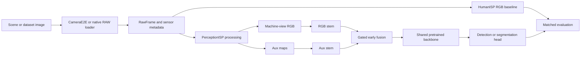

# PerceptionISP

[](https://github.com/SeongcheolJeong/PerceptionISP/actions/workflows/ci.yml)

PerceptionISP is a software reference pipeline for studying camera processing
that serves both human-view RGB and machine-perception tasks. It accepts
sensor-like RAW frames, runs configurable ISP blocks, emits RGB plus auxiliary
maps, and provides matched detection, segmentation, edge, CFA, and LensPSF
evaluation workflows.

This repository is an engineering feasibility platform. Current evidence does
not support a general claim that PerceptionISP outperforms a conventional
HumanISP on every dataset or operating point.

## Architecture



The default learned path is early fusion: RGB and Aux have separate first
stems, a learnable gate combines their features, and the existing pretrained
backbone and task head process the fused result. Post-hoc proposal calibration
is retained as an evaluation baseline, not presented as the primary learned
architecture.

## Implemented Areas

- Sensor contracts, CFA metadata, native Bayer loading, HDR exposure stacks,
  black/white-level normalization, defect handling, lens shading, demosaic,
  denoise, tone mapping, color processing, and optional dewarp.
- Accurate and fast perception paths with RGB tensors, edge packets, noise,
  saturation, HDR-source, motion, and edge-related auxiliary maps.
- CameraE2E bridge, synthetic scenes, KITTI, PASCAL RAW, AODRaw, LOD, LIS,
  SID, COCO/YOLO dataset adapters, caching, and split utilities.
- RGB-only, RGB+Aux, gated early-fusion, feature-distillation, compact dense,
  YOLO detection, and segmentation training/evaluation paths.
- HumanISP comparison, CFA/LensPSF sweeps, object-boundary diagnostics,
  condition/task gates, counterexample audits, and HTML rollups.

See [Architecture](docs/ARCHITECTURE.md) and
[Evidence and limitations](docs/EVIDENCE_AND_LIMITATIONS.md) for exact claim
boundaries.

## Install

Python 3.11 or newer is required.

```bash
python3.11 -m venv .venv
source .venv/bin/activate
python -m pip install --upgrade pip
python -m pip install -e .
```

Install only the capabilities you need:

```bash
python -m pip install -e '.[raw]'        # rawpy
python -m pip install -e '.[ml]'         # PyTorch, Ultralytics, OpenCV, YAML
python -m pip install -e '.[camerae2e]'  # h5py; CameraE2E remains a local checkout
python -m pip install -e '.[dev]'        # pytest and package build tools
```

## Quick Run

```bash
perception-isp isp run \
  --width 320 --height 180 \
  --cfa RGGB \
  --demosaic-method edge_aware
```

Outputs are written to `${PERCEPTION_ISP_OUTPUT:-reports}/perception_isp_demo`.
List all workflows with:

```bash
perception-isp --help
perception-isp train yolo-aux --help
perception-isp evaluate detection --help
```

## CameraE2E

```bash
export CAMERAE2E_ROOT=/path/to/CameraE2E
perception-isp isp run --camerae2e --scene 'uniform ee' --cfa auto
```

`--cfa auto` preserves the source sensor CFA when CameraE2E exposes it. A
requested explicit CFA is treated as the target pattern and recorded in frame
provenance.

## Repository Layout

```text
src/perception_isp/core/        sensor and ISP runtime
src/perception_isp/datasets/    acquisition, loading, conversion, splitting
src/perception_isp/training/    RGB/Aux training and distillation
src/perception_isp/evaluation/  metrics, sweeps, audits, claim gates
src/perception_isp/reporting/   evidence dashboards and rollups
docs/                           current manuals and archived research history
examples/                       small runnable examples
scripts/data/                   guarded dataset acquisition helpers
tests/                          unit and workflow regression tests
```

Large datasets, checkpoints, reports, exports, and training runs are local
artifacts and are intentionally excluded from Git.

## Documentation

- [Korean user guide](docs/USER_GUIDE_KO.md)
- [Architecture](docs/ARCHITECTURE.md)
- [Evidence and limitations](docs/EVIDENCE_AND_LIMITATIONS.md)
- [Development guide](docs/DEVELOPMENT.md)
- [v0.1 to v0.2 migration](docs/MIGRATION_V0_2.md)
- [Research and historical material](docs/README.md)

## Test

```bash
python -m unittest discover -s tests -p 'test_*.py'
```

Tests that require optional datasets, CameraE2E, rawpy, PyTorch, or
Ultralytics skip when those resources are unavailable.
