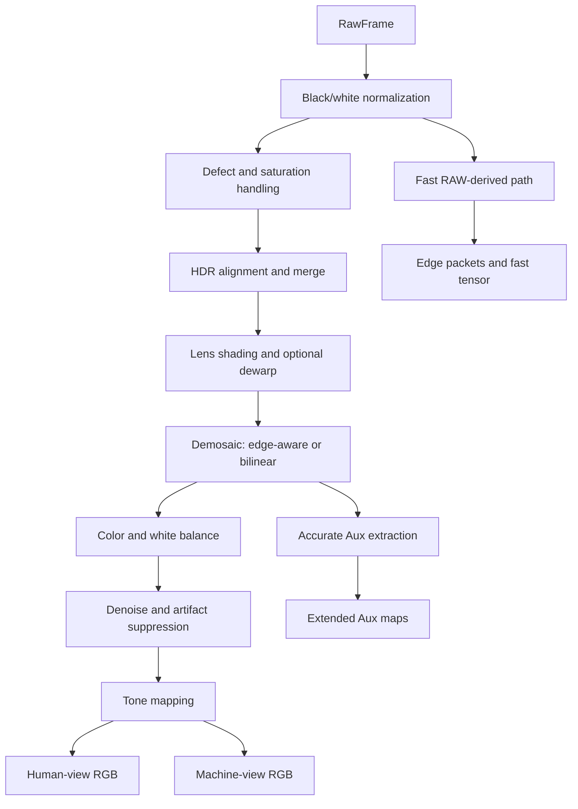
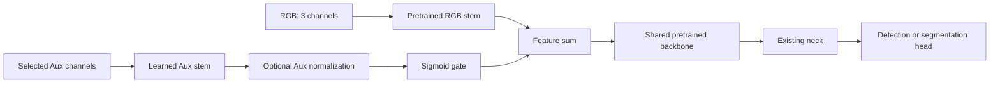

# Architecture

## System Objective

PerceptionISP keeps one sensor-domain source of truth and produces two
comparable views:

1. HumanISP RGB optimized for display-oriented image quality.
2. PerceptionISP RGB and auxiliary evidence optimized for downstream tasks.

The evaluation contract requires the same scene, RAW sample, annotation,
resolution, detector family, and operating point unless a controlled ablation
explicitly changes one variable.

## RAW Contract

`RawFrame` carries:

- one or more RAW exposure planes;
- `SensorMetadata`, including CFA, exposure ratios, timing, and sensor IDs;
- `CalibrationProfile`, including black/white levels, gains, color and lens
  information;
- provenance describing native CFA, remosaic, CameraE2E, and source assets.

The ISP must consume the source CFA recorded in metadata. A requested target
CFA is allowed for a controlled remosaic experiment but must not be reported
as native sensor evidence.

Per-exposure time and gain arrays must contain either one broadcast value or
one value per RAW exposure plane. Gain is removed during physical RAW
normalization; HDR radiance scaling therefore uses exposure time only. A
metadata/calibration CFA mismatch is rejected rather than silently remapped.

Metadata has three implementation states:

- **active processing:** exposure time, gains, temperature, CFA, frame timing,
  line time, and readout direction;
- **propagated only:** frame counter, camera synchronization ID, HDR
  mode/ratios, rolling-shutter duration, module identifiers, and profile
  identifiers;
- **declared but unused:** currently `color_shading_gain`.

## Software ISP Flow



The implementation is a software reference. Latency fields are estimates, not
measurements from a production hardware ISP.

## Auxiliary Evidence

Available channels depend on the export profile and include combinations of:

- edge magnitude, orientation, confidence, and demosaic-risk evidence;
- noise and saturation estimates;
- HDR source/exposure selection;
- motion or temporal confidence when previous-frame information is available;
- raw-normalized, luma, and machine-view feature inputs.

The public `saturation` map means that at least one source exposure crossed the
saturation threshold. `clipping_distance` is also derived from source-exposure
risk. Neither field by itself proves that the final fused HDR value is clipped
or recovered; known-radiance error must be evaluated separately.

Aux maps are not class labels. An RGB-trained detector cannot consume them
without an adapter, a modified input stem, or a separate calibrated fusion
path.

## Learned Early Fusion

The primary learned architecture is:



For `gated_sum`, the first fused feature is:

```text
F = RGBStem(RGB) + sigmoid(g) * AuxStem(Aux)
```

`gated_norm_sum` normalizes the Aux branch before applying the gate. A negative
initial gate logit starts training near the RGB baseline. The RGB branch can be
frozen while Aux learns, then jointly fine-tuned if the data volume supports
it.

Feature distillation uses a frozen RGB teacher and trains the Aux adapter to
approximate an early RGB feature. It is an initialization strategy, not the
final task objective.

## Baselines

- **RGB-only learned baseline:** same pretrained model, split, image size,
  epochs, seed, augmentation, and evaluation operating point.
- **Post-hoc RGB+Aux calibration:** keeps RGB class labels and adjusts proposal
  scores/boxes using Aux evidence. This tests signal utility but does not prove
  that a DNN learned to use Aux.
- **Aux-only detector:** diagnostic only. Edge maps do not contain object class
  semantics and should not be compared as an independent label-aware detector.

## Package Boundaries

- `core`: sensor contracts, ISP, synthetic generation, Aux tensors, detector
  adapters, shared paths.
- `datasets`: download/import guards, native loaders, cache, conversion, split.
- `training`: compact, YOLO early-fusion, distillation, segmentation training.
- `evaluation`: metrics, matched comparisons, sweeps, diagnostics, claim gates.
- `reporting`: HTML casebooks, dashboards, evidence and training rollups.

Code should import these modules using absolute package paths. The v0.1 flat
module layout is not a public compatibility surface in v0.2.

## Evaluation Layers

1. Unit and synthetic mechanism tests.
2. Native-CFA and LensPSF provenance checks.
3. RGB-only versus RGB+Aux matched task metrics.
4. Condition slices: low light, blur/MTF, demosaic artifacts, adverse weather.
5. Object slices: small, thin/long, occluded, weak or short boundaries.
6. Multi-seed held-out gates and bootstrap intervals.
7. Visual success/failure casebooks and counterexample audits.

No single diagnostic layer is sufficient for a broad performance claim.
