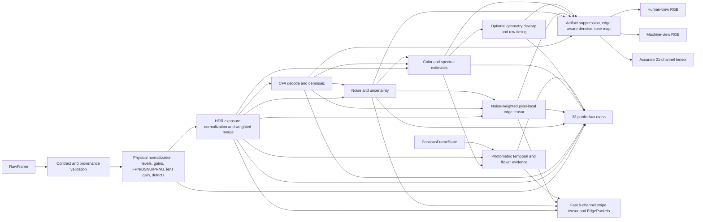
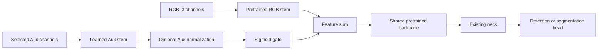

# Architecture

## System Objective

PerceptionISP keeps one sensor-domain source of truth and produces two
comparable views:

1. HumanISP RGB optimized for display-oriented image quality.
2. PerceptionISP RGB and auxiliary evidence optimized for downstream tasks.

The evaluation contract requires the same scene, RAW sample, annotation,
resolution, detector family, and operating point unless a controlled ablation
explicitly changes one variable.

## RAW Contract

`RawFrame` carries:

- one or more RAW exposure planes;
- `SensorMetadata`, including CFA, exposure ratios, timing, and sensor IDs;
- `CalibrationProfile`, including black/white levels, gains, color and lens
  information;
- provenance describing native CFA, remosaic, CameraE2E, and source assets.

The ISP must consume the source CFA recorded in metadata. A requested target
CFA is allowed for a controlled remosaic experiment but must not be reported
as native sensor evidence.

Per-exposure time and gain arrays must contain either one broadcast value or
one value per RAW exposure plane. Gain is removed during physical RAW
normalization; HDR radiance scaling therefore uses exposure time only. A
metadata/calibration CFA mismatch is rejected rather than silently remapped.
When an exposure-specific metadata vector is present, its length identifies
the exposure axis, so the pipeline is not limited to four planes and accepts
small spatial dimensions. With a declared exposure count, an equal first/last
axis is interpreted as canonical exposure-major `E x H x W`; without that
metadata, ambiguous shapes are rejected. `H x W x E` callers should therefore
use a last-axis exposure count that is unambiguous.

External examples use explicit provenance classes:

- `simulated_scaled_bracket`: the legacy compatibility path scales one
  simulated mosaic;
- `simulated_multi_exposure`: CameraE2E computes sensor planes at multiple
  integration times from an RGB-rendered scene, either from an explicit vector
  or from a converged AE anchor plus explicit EV offsets;
- `nuscenes_processed_jpeg_pseudo_raw`: each processed JPEG is converted as a
  single-exposure frame within one stateful delayed-AE sequence;
- `nuscenes_processed_jpeg_inter_frame_hdr_stress`: consecutive processed
  JPEGs from one camera are captured in AE-controlled AEB cycles, then grouped
  as unregistered `E x H x W` inter-frame stress stacks. Its
  combined `capture_type`/`raw_provenance` is
  `experimental_inter_frame_hdr_stress`;
- `native_sensor`: a strict `E x H x W` sensor-code bundle with complete
  metadata and calibration.

Only the last class supports a native-source claim. RGB/JPEG-derived inputs
remain pseudo-RAW even when CameraE2E models sensor integration.

These classes also define four different evidence levels. Static CameraE2E HDR
checks multiple simulated integrations of one fixed RGB scene. Temporal
nuScenes checks per-frame AE/ISP state and metadata without forming an HDR
stack. Inter-frame nuScenes deliberately groups AEB slots from different
moments to expose motion, flicker, and merge risk. Native HDR accepts actual
sensor planes and capture
metadata, but still does not prove registration or deghosting unless those
operations are separately implemented and evaluated.

Metadata origin auditing stays in provenance and does not expand the public
`SensorMetadata` type. `provenance["metadata_field_origins"]` is a flat
field-path-to-category map using `sensor.*`, `calibration.*`, and `source.*`
paths. All `SensorMetadata` fields are represented. Allowed categories are:

- `source_dataset`: read directly from a dataset table or source file;
- `simulator_configured`: requested by the bridge before simulation;
- `simulator_readback`: read back from simulator state or output;
- `bridge_assumed`: a neutral/default bridge value, not a source fact;
- `unknown`: unavailable and deliberately not inferred.

For nuScenes, dataset timestamps, stream IDs, frame counters, intrinsics, and
poses remain source values, while source exposure/gain/WB/CFA/black/white data
remain unknown. Converter-side origins are kept separately under
`simulated_capture_metadata_field_origins`, so simulated settings cannot be
mistaken for source-camera metadata.

The explicit CameraE2E path records requested and read-back integration times
and sensor-noise seeds. It consumes analog `sensor.volts`, then applies the
bridge-owned linear `[64, 4095]` pseudo-code mapping; it does not claim native
ADC values. `hdr_mode` and `hdr_ratios` are bridge-derived from the read-back
exposure vector. A target CFA that differs from CameraE2E sensor readback is
also bridge-owned. RCCB clear and RGBIR IR samples are RGB proxy formulas, not
native spectral measurements.

The stateful CameraE2E path reports HW-ISP gain as an effective multiplier.
CameraE2E's legacy sensor field is a reciprocal voltage divisor, so the
capture layer applies `sensor_divisor = 1 / effective_gain` and validates the
reciprocal readback. AE and AE+AEB capture fail on a mismatch; they never
silently switch to a direct RGB converter. Plain AE returns one RAW frame per
moment. AEB keeps its AE base fixed over the complete EV-slot cycle and meters
only the `0 EV` reference slot before updating a later cycle.

The inter-frame adapter calls frames consecutive only after matching their scene
token and reciprocal `sample_data.prev/next` links and validating finite
sensor-to-global poses. Native bundles reject `simulator_configured` and
`simulator_readback` origins on all sensor/calibration fields.

Temporal simulations allocate deterministic distinct seeds by frame and retain
requested/read-back seed schedules in provenance. This prevents identical RNG
streams from repeating across independent calls. CameraE2E currently samples
shot, read, and fixed-pattern noise from one RNG, so fixed-pattern persistence
across calls remains explicitly uncalibrated. External HTML reports render the
field/value/origin audit and inter-frame plane-source audit as visible tables.

Metadata has three implementation states:

- **active processing:** exposure time, gains, temperature, CFA, frame timing,
  line time, and readout direction;
- **propagated only:** frame counter, camera synchronization ID, HDR
  mode/ratios, rolling-shutter duration, module identifiers, and profile
  identifiers;
- **declared but unused:** currently `color_shading_gain`.

## Software ISP Flow



The implementation is a software reference. Latency fields are estimates, not
measurements from a production hardware ISP.

Lens-shading gain is applied inside physical normalization before HDR fusion.
The color stage estimates white-balance gains and a global balance confidence,
but does not currently apply the estimated gains to RGB. Temporal outputs feed
Aux, fast-path, runtime, and next-state contracts; they do not currently modify
Human-view or Machine-view RGB formation. Geometry dewarp affects only the
accurate branch. These distinctions are intentional documentation of the
current code, not a production ISP recommendation.

The HDR block normalizes exposure time, estimates inter-plane disagreement,
downweights motion risk, and merges the planes. It does not estimate optical
flow, use nuScenes ego pose to warp images, or geometrically register exposure
planes. “Ghost-motion artifact” is therefore a risk map, not proof that motion
has been compensated.

Temporal dataset converters that resize, crop, or warp an image must declare a
finite affine `source_to_raw_pixel_matrix`. Dataset adapters apply that matrix
to the source camera intrinsic instead of inferring geometry from array shape.

## Auxiliary Evidence

Available channels depend on the export profile and include combinations of:

- edge magnitude, orientation, confidence, and demosaic-risk evidence;
- noise and saturation estimates;
- HDR source/exposure selection;
- motion or temporal confidence when previous-frame information is available;
- raw-normalized, luma, and machine-view feature inputs.

The public `saturation` map means that at least one source exposure crossed the
saturation threshold. `clipping_distance` is also derived from source-exposure
risk. Neither field by itself proves that the final fused HDR value is clipped
or recovered; known-radiance error must be evaluated separately.

Aux maps are not class labels. An RGB-trained detector cannot consume them
without an adapter, a modified input stem, or a separate calibrated fusion
path.

## Learned Early Fusion

The primary learned architecture is:



For `gated_sum`, the first fused feature is:

```text
F = RGBStem(RGB) + sigmoid(g) * AuxStem(Aux)
```

`gated_norm_sum` normalizes the Aux branch before applying the gate. A negative
initial gate logit starts training near the RGB baseline. The RGB branch can be
frozen while Aux learns, then jointly fine-tuned if the data volume supports
it.

Feature distillation uses a frozen RGB teacher and trains the Aux adapter to
approximate an early RGB feature. It is an initialization strategy, not the
final task objective.

## Baselines

- **RGB-only learned baseline:** same pretrained model, split, image size,
  epochs, seed, augmentation, and evaluation operating point.
- **Post-hoc RGB+Aux calibration:** keeps RGB class labels and adjusts proposal
  scores/boxes using Aux evidence. This tests signal utility but does not prove
  that a DNN learned to use Aux.
- **Aux-only detector:** diagnostic only. Edge maps do not contain object class
  semantics and should not be compared as an independent label-aware detector.

## Package Boundaries

- `core`: sensor contracts, ISP, synthetic generation, Aux tensors, detector
  adapters, shared paths.
- `datasets`: download/import guards, native loaders, cache, conversion, split.
- `training`: compact, YOLO early-fusion, distillation, segmentation training.
- `evaluation`: metrics, matched comparisons, sweeps, diagnostics, claim gates.
- `reporting`: HTML casebooks, dashboards, evidence and training rollups.

Code should import these modules using absolute package paths. The v0.1 flat
module layout is not a public compatibility surface in v0.2.

## Evaluation Layers

1. Unit and synthetic mechanism tests.
2. Native-CFA and LensPSF provenance checks.
3. RGB-only versus RGB+Aux matched task metrics.
4. Condition slices: low light, blur/MTF, demosaic artifacts, adverse weather.
5. Object slices: small, thin/long, occluded, weak or short boundaries.
6. Multi-seed held-out gates and bootstrap intervals.
7. Visual success/failure casebooks and counterexample audits.

No single diagnostic layer is sufficient for a broad performance claim.
