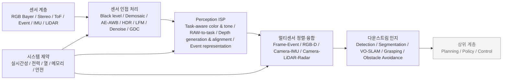

# 로봇 탑재형 Perception ISP 동향 보고서

## 요약

이 보고서에서 말하는 **로봇용 perception ISP**는 전통적 의미의 이미지 신호 처리기(ISP)를 그대로 뜻하지 않는다. 더 정확히는, **카메라·깊이 센서·이벤트 카메라·보조 센서의 원시 혹은 준원시 데이터를 사람 보기용 영상으로만 최적화하지 않고, 로봇의 인지 정확도·지연·전력·열 제약에 맞춰 전처리·정렬·융합하는 프런트엔드 계층**을 뜻한다. 학계에서는 이를 *task-aware ISP*, *machine vision ISP*, *computer vision ISP*, *RAW-to-task pipeline* 같은 표현으로 다루고, 한국어 정책 문헌에서는 더 넓게 **지각 특화 AI 반도체** 혹은 멀티모달 전처리 계층으로 설명하는 경향이 있다. ETRI는 이 계층의 핵심 조건으로 **실시간 환경 인식, 멀티모달 대용량 데이터 처리, 초저지연·고효율 엣지 임베디드 연산**을 제시하고 있다. citeturn25view3turn37view0turn24view3

최근 3~5년의 핵심 변화는 세 가지로 요약된다. 첫째, **ISP가 “보기 좋은 RGB”를 만드는 모듈에서 “검출·분할·SLAM에 유리한 표현”을 만드는 모듈로 이동**하고 있다. CVPR 2023의 RAW object detection, CVPR 2025의 AODRaw, ICCV 2025의 Dark-ISP, CVPR 2026의 TA-ISP는 이 변화를 직접 보여준다. 둘째, **이벤트 카메라와 프레임 카메라의 비동기 융합**이 저지연 인지의 핵심 축으로 부상했다. Nature 2024는 20 fps RGB 카메라와 이벤트 카메라 조합이 **5,000 fps 카메라 수준의 지각 지연**을 구현할 수 있음을 보였고, CVPR 2025 ACGR은 프레임 동기화 대신 **비동기 200 Hz 추론**을 제시했다. 셋째, **깊이·센서 융합 프런트엔드가 온디바이스로 내려오고 있다.** EN-SLAM, Active Event-based Stereo Vision, RealSense D555, Orbbec Gemini 330은 깊이 생성·정렬·노이즈 억제·시간 동기화를 카메라/SoC 측으로 끌어들이는 흐름을 보여준다. citeturn36view0turn37view1turn39search1turn37view0turn22view0turn38view1turn37view2turn37view3turn33view0turn30view3

상용화 측면에서는 **전용 ISP 단품**보다 **센서 내 ISP**, **ISP+비전 엔진 SoC**, **깊이 엔진 ASIC**, **AI-ISP 소프트웨어 정의 파이프라인**으로 양분되는 것이 특징이다. Sony는 ISX038에서 **RAW와 YUV를 동시에 출력하는 센서 내 ISP**를 내놓았고, OmniVision은 OAX4000/OAX4600으로 **머신비전과 인간보기 파이프라인의 분기** 및 **ISP+NPU 통합**을 밀고 있다. Qualcomm과 Ambarella는 ISP를 독립 제품이 아니라 **멀티카메라·CV 가속·NPU가 결합된 로보틱스 SoC**의 일부로 제공한다. Intel 계열은 Movidius, RealSense를 통해 **ISP와 비전 처리, 깊이 처리의 결합형 접근**을 보여주며, 최신 RealSense D555는 RGB 보정용 ISP와 스테레오 disparity 처리, 모션 추정을 Vision SoC V5에 통합했다. citeturn15view2turn24view2turn15view3turn24view3turn15view1turn15view4turn24view4turn33view0

산업적으로는 **“온센서 AI vs 메인 SoC” 사이의 중간 계층**이 공백 시장으로 인식되고 있다. ETRI는 온센서 AI만으로는 센서 수·해상도·프레임 증가에 따른 융합·전력·지연 문제를 감당하기 어렵고, 온디바이스 AI 단독으로도 멀티모달·메모리·지연성 제약이 크다고 지적한다. 이 때문에 향후 5년은 **자동화된 ISP 튜닝**, **AI-ISP의 OTA 업데이트**, **이벤트-프레임-깊이의 다중센서 프런트엔드**, **기능안전·사이버보안 규격 내재화**가 승부처가 될 가능성이 높다. 예산과 목표 플랫폼은 사용자 요청상 **미지정**이다. citeturn25view1turn28view2turn27search0turn24view0turn23search10

## 개념 정의와 범위

본 보고서에서는 로봇용 perception ISP를 **센서 출력에서 다운스트림 인지 모델 직전까지의 저수준 지각 파이프라인**으로 정의한다. 여기에는 Bayer RAW 전처리, demosaic/white balance/color correction 같은 전통 ISP 기능뿐 아니라, 로봇용으로 중요한 **HDR, LED flicker mitigation, denoising, geometric distortion correction, depth 생성·정렬·융합, 이벤트 스트림 표현화, 프레임-이벤트-깊이-IMU-라이다 등 다중센서 시간·공간 정렬, 실시간 스케줄링, 전력·열 예산 관리, 온디바이스·엣지 분배**가 포함된다. Sony, Qualcomm, Ambarella, RealSense, Orbbec의 공식 문서는 이 계층을 각각 **RAW/YUV 동시 출력**, **computer vision engine**, **advanced image processor + dense stereo/optical flow**, **stereo disparity + motion estimation + RGB ISP**, **depth image generation + color alignment inside camera**라는 형태로 구현하고 있다. citeturn15view2turn24view3turn15view4turn33view0turn20search5

반대로 이 보고서의 범위에서 **제외**하는 것은 다음과 같다. 고수준 의미추론, 행동계획, 경로 최적화, LLM/VLA 기반 의사결정, 로봇 제어기 자체, 영상 압축/전송만을 목적으로 한 codec 파이프라인, 그리고 카메라와 무관한 라이다·레이다 단독 신호처리 전체는 제외한다. 다만 **camera-lidar/radar/event fusion이 다운스트림 인지 정확도와 지연을 좌우하는 전처리 계층**으로 들어올 때는 포함한다. 이 경계 설정은 ETRI가 말한 “실시간 환경 인식·멀티모달 대용량 데이터 처리·초저지연 엣지 연산”의 중간 계층 정의와 부합한다. citeturn25view3turn25view2

전통 ISP와 perception ISP의 차이는 목표 함수에 있다. 전통 ISP가 주로 **사람 눈에 자연스러운 RGB**를 목표로 한다면, perception ISP는 **검출·분할·VO/SLAM·깊이 추정·충돌회피의 정확도와 안정성**을 목표로 한다. CVPR 2023 RAW object detection은 RAW가 본래 HDR 정보를 보존한다는 점을 이용해 자율주행 장면 검출을 개선했고, CVPR 2026 TA-ISP는 아예 **downstream vision model을 위한 task-oriented representation**을 만드는 경량 RAW-to-RGB 연산자로 ISP를 재정의한다. Qualcomm은 CV 블록(EVA)과 ISP를 함께 배치해 **실시간 이미지 처리 지연 감소**를 강조하고, RealSense D555는 RGB 측 ISP(GDC, TNR)와 스테레오 disparity·모션 추정을 하나의 Vision SoC로 묶는다. citeturn36view0turn37view0turn24view3turn33view0

다음 개념도는 로봇 탑재형 perception ISP의 실무적 경계를 보여준다. 도식은 학술 논문의 task-aware ISP 개념, 공식 벤더의 카메라/SoC 아키텍처, 그리고 ETRI의 지각 특화 AI 반도체 개념을 종합한 것이다. citeturn37view0turn24view3turn33view0turn25view3

포함 기능을 항목별로 정리하면 다음과 같다.

| 포함 기능 | 로봇 맥락에서 의미 | 근거 |
|---|---|---|
| 이미지/비전 전처리 | demosaic, white balance, color correction, geometric correction은 여전히 필요하지만 목표가 시각 품질보다 다운스트림 인지 성능으로 이동 | citeturn35search7turn33view0turn24view4 |
| HDR·WDR·LFM | 역광·실외·야간·LED 표지판 환경에서 인지 실패를 줄이는 핵심 기능 | citeturn24view1turn24view2turn19search2 |
| Denoising·저조도 보정 | 저조도 환경에서 SNR 확보와 검출/분할 안정성 향상 | citeturn39search1turn29view0turn28view2 |
| Depth fusion | stereo/active stereo/RGB-D/event-depth를 통해 로봇의 3D 환경 표현 형성 | citeturn37view3turn37view2turn33view0turn30view3 |
| Event camera processing | µs급 시간 해상도와 HDR·저전력 특성을 활용해 고속·고동적 상황에서 지연 감소 | citeturn26view1turn19search0turn19search1 |
| Sensor fusion | 프레임-이벤트, RGB-D, camera-IMU, camera-LiDAR/radar의 시간·공간 정렬과 feature/graph 수준 융합 | citeturn38view1turn37view2turn6search7 |
| Low-latency / real-time constraints | perception blind time를 줄이고 10ms급~수십ms급 의미화 레이어를 지향 | citeturn22view0turn25view1 |
| Power / thermal management | SoC·카메라 내부 처리로 외부 대역폭과 호스트 전력을 줄이는 방향이 핵심 | citeturn30view3turn28view2turn24view3 |
| On-device vs edge/cloud 분배 | 클라우드는 네트워크 지연 문제를 가지며, on-device는 프라이버시·지연·TCO 면에서 유리하지만 단독 한계도 존재 | citeturn22view0turn28view0turn25view1 |

## 학술 연구 동향

최근 학술 흐름은 **RAW 직접 활용**, **악조건 강건성**, **이벤트 기반 저지연**, **깊이·SLAM 융합**, **하드웨어 친화 경량화**의 다섯 갈래로 수렴한다. 초기 연구가 “RAW를 쓰면 정보를 더 많이 보존할 수 있다”는 증명에 가까웠다면, 2024년 이후 연구는 “**어떤 ISP 표현이 특정 로봇 과제에 가장 유리한가**”라는 문제로 넘어갔다. TA-ISP, POS-ISP, UniISP 같은 최근 작업은 ISP 블록을 더 이상 고정 함수가 아니라 **학습 가능하고 과제 종속적인 연산자 집합**으로 본다. citeturn36view0turn37view0turn35search5turn35search7

악조건 대응에서는 저조도·비·안개·역광·야간 운전이 핵심 벤치마크가 되었다. AODRaw는 9개 조합의 조도·기상 조건 RAW 데이터셋을 제공했고, Dark-ISP는 저조도 Bayer RAW를 직접 처리하는 **가벼운 self-adaptive ISP plugin**을 제안했다. HDR 측면에서는 RawHDR와 Neural Exposure Fusion이 기존 이미지공간 HDR 합성 대신 **RAW 혹은 feature-domain 융합을 다운스트림 과제와 연결**하는 방향을 보인다. 이는 로봇이 어두운 영역의 시인성과 밝은 영역의 포화 방지를 동시에 요구하기 때문이다. citeturn37view1turn39search1turn36view4turn13view5

이벤트 기반 연구는 단순 센서 대체가 아니라 **프레임 카메라의 블라인드 타임을 메우는 보조시간축**으로 자리 잡고 있다. Nature 2024의 hybrid detector는 20 fps RGB + event 조합으로 5,000 fps 카메라 수준의 지각 지연을 달성했고, ACGR은 이벤트를 프레임과 강제 동기화하지 않고 **통합 그래프에서 비동기 처리**한다. HMNet은 variable-rate latent memory 구조로 이벤트 기반 dense prediction의 지연을 40~50% 줄였고, CVPR 2025의 on-device event depth는 드론에서 milliwatt급 전력으로 온라인 학습까지 보여주었다. citeturn22view0turn38view1turn38view0turn38view2

깊이와 SLAM 영역에서도 perception ISP의 역할이 커졌다. EN-SLAM은 event-RGBD implicit neural SLAM을 제안해 motion blur와 lighting variation에 강한 tracking/mapping을 보였고, Active Event-based Stereo Vision은 적외선 패턴을 쓰는 능동 스테레오를 event camera와 결합해 **150 FPS** 깊이 추론을 달성했다. ICRA 2025 Best Paper on Robot Perception으로 선정된 MAC-VO는 stereo VO에서 **uncertainty-aware covariance**를 front-end 특징 선택과 후단 pose graph weighting에 함께 쓰며, perception 프런트엔드가 곧 강건한 state estimation의 일부가 되고 있음을 보여준다. citeturn37view2turn37view3turn9search10turn37view4

대표 논문은 다음과 같다. 원문은 대부분 영문이며, 이 분야의 한국어 원논문은 제한적이어서 산업·정책 파트에서 한국어 자료를 우선 활용했다.

| 한글 제목 | 영문 제목 | 저자 | 연도 | 핵심 기여 | 원문 |
|---|---|---|---|---|---|
| 고급 시각 인지를 위한 과업 인지형 이미지 신호 처리기 | *Task-Aware Image Signal Processor for Advanced Visual Perception* | Kai Chen, Jin Xiao, Leheng Zhang, Kexuan Shi, Shuhang Gu | 2026 | 경량 RAW-to-RGB 조절 연산으로 detection/segmentation에 유리한 과업 지향 표현 생성, 메모리·연산·지연 제약을 동시에 고려 | CVPR 2026 원문 citeturn37view0 |
| RAW 객체 검출을 향하여: 새로운 벤치마크와 모델 | *Toward RAW Object Detection: A New Benchmark and a New Model* | Ruikang Xu 외 | 2023 | 24-bit HDR RAW 주행 데이터셋 ROD와 end-to-end RAW object detection 제안, SDR 대비 RAW의 이점 실증 | CVPR 2023 원문 citeturn36view0 |
| 다양한 조건에서의 RAW 객체 검출 | *Towards RAW Object Detection in Diverse Conditions* | Zhong-Yu Li, Xin Jin, Bo-Yuan Sun, Chun-Le Guo, Ming-Ming Cheng | 2025 | AODRaw 데이터셋 공개, 조도·기상 변화 환경에서 RAW 사전학습과 distillation의 효과 제시 | CVPR 2025 원문 citeturn37view1 |
| Dark-ISP: 저조도 객체 검출을 위한 RAW 처리 향상 | *Dark-ISP: Enhancing RAW Image Processing for Low-Light Object Detection* | J. Guo 외 | 2025 | 저조도 Bayer RAW를 직접 처리하는 self-adaptive ISP plugin으로 end-to-end object detection 최적화 | ICCV 2025 원문 citeturn39search0turn39search1 |
| 고동적 범위 객체 검출을 위한 신경망 노출 융합 | *Neural Exposure Fusion for High-Dynamic Range Object Detection* | Elias Onzon 외 | 2024 | 기존 이미지공간 HDR이 아닌 feature-domain exposure fusion을 detection loss로 최적화 | CVPR 2024 원문 citeturn13view5 |
| 단일 RAW 영상으로부터의 HDR 복원 | *RawHDR: High Dynamic Range Image Reconstruction from a Single Raw Image* | Yunhao Zou, Chenggang Yan, Ying Fu | 2023 | sRGB보다 정보가 풍부한 RAW에서 직접 HDR을 복원하는 접근 | ICCV 2023 원문 citeturn36view4 |
| 카메라 ISP 파이프라인을 위한 열화-독립 표현 학습 | *Learning Degradation-Independent Representations for Camera ISP Pipelines* | Yanhui Guo, Fangzhou Luo, Xiaolin Wu | 2024 | ISP 산출물의 복합 열화를 분리해 다운스트림 인식에 견고한 표현 학습 | CVPR 2024 원문 citeturn36view3 |
| RAW Bayer 영상용 키포인트 검출과 기술자 | *Keypoint Detection and Description for Raw Bayer Images* | Jiakai Lin, Jinchang Zhang, Guoyu Lu | 2025 | ISP를 우회해 RAW에서 직접 로컬 특징을 추출, SLAM·매칭용 전처리 경량화 | ICRA 2025 원문 citeturn8search3turn9search6 |
| 저지연 이벤트 처리를 위한 계층형 신경 메모리 네트워크 | *Hierarchical Neural Memory Network for Low Latency Event Processing* | Ryuhei Hamaguchi, Yasutaka Furukawa, Masaki Onishi, Ken Sakurada | 2023 | variable-rate memory로 이벤트 dense prediction 지연 40~50% 절감 | CVPR 2023 원문 citeturn38view0 |
| 프레임과 이벤트를 위한 비동기 협업 그래프 표현 | *Asynchronous Collaborative Graph Representation for Frames and Events* | Dianze Li, Jianing Li, Xu Liu, Xiaopeng Fan, Yonghong Tian | 2025 | 프레임율에 묶이지 않는 비동기 융합, object detection/depth estimation에서 최대 200 Hz 실시간 추론 | CVPR 2025 원문 citeturn38view1 |
| 멀티태스크 협업 기반 이벤트-가시광-적외선 융합 | *Event-based Visible and Infrared Fusion via Multi-task Collaboration* | M. Geng 외 | 2024 | 이벤트 카메라를 가시광 대체 축으로 활용해 blur와 조명 변화에 강한 VIF 구현 | CVPR 2024 원문 citeturn36view5 |
| 암시적 이벤트-RGBD 뉴럴 SLAM | *Implicit Event-RGBD Neural SLAM* | Delin Qu, Chi Yan, Dong Wang, Jie Yin, Qizhi Chen, Dan Xu, Yiting Zhang, Bin Zhao, Xuelong Li | 2024 | motion blur·조명 변화 환경에서 event+RGBD 기반 implicit SLAM, 실시간 17 FPS | CVPR 2024 원문 citeturn37view2 |
| 능동 이벤트 기반 스테레오 비전 | *Active Event-based Stereo Vision* | Jianing Li, Yunjian Zhang, Haiqian Han, Xiangyang Ji | 2025 | event stereo + IR projector 융합으로 고속 깊이 센싱, 추론 속도 최대 150 FPS | CVPR 2025 원문 citeturn37view3 |
| 이벤트만으로 저지연 단안 깊이를 온디바이스 자기지도 학습 | *On-Device Self-Supervised Learning of Low-Latency Monocular Depth from Only Events* | Jesse J. Hagenaars, Yilun Wu, Federico Paredes-Vallés, Stein Stroobants, Guido de Croon | 2025 | 소형 드론에서 온보드 depth 학습, event의 milliwatt급 전력과 100~200 Hz 학습·추론 활용 | CVPR 2025 원문 citeturn38view2 |
| 메트릭 인지 공분산 기반 학습형 스테레오 시각 주행계 | *MAC-VO: Metrics-aware Covariance for Learning-based Stereo Visual Odometry* | Yuheng Qiu, Yutian Chen, Zihao Zhang, Wenshan Wang, Sebastian Scherer | 2025 | 학습형 stereo VO에서 front-end uncertainty와 pose graph 최적화를 결합, ICRA 2025 Robot Perception 수상 | arXiv/ICRA 2025 원문 citeturn37view4turn9search10 |

요약하면, 학계의 주제어는 **RAW-to-task**, **task-aware ISP**, **event-frame asynchronous fusion**, **depth-in-the-loop**, **on-device learning**으로 수렴하고 있다. 이는 상용 세계에서 나타나는 **ISP+NPU 통합**, **camera-internal depth alignment**, **software-defined AI ISP**와 정확히 맞물린다. citeturn37view0turn38view1turn38view2turn28view2

## 상용 벤더와 제품 비교

상용 시장은 크게 세 부류로 나뉜다. 첫째는 **센서 내 ISP형**이다. Sony ISX038처럼 센서에서 RAW와 YUV를 동시에 내보내며, 한 카메라로 machine vision과 human viewing 파이프라인을 분기한다. 둘째는 **companion ISP ASIC형**이다. OmniVision OAX4000처럼 다수 카메라를 받아 HDR/LFM, 톤매핑, CFA 처리, dual-pipeline 출력을 담당한다. 셋째는 **integrated robotics SoC형**이다. Qualcomm RB5/RB6, Ambarella N1, Intel/RealSense Vision SoC처럼 ISP를 CV 엔진·NPU·stereo/depth 엔진과 한 칩에 넣는다. 즉, 로봇 분야의 핵심은 “더 좋은 ISP 단품”보다 “**인지 파이프라인 전체를 얼마나 낮은 지연과 전력으로 묶을 수 있는가**”에 있다. citeturn15view2turn24view2turn24view3turn15view4turn33view0

| 벤더 | 제품 | 분류 | 핵심 기능 | 지원 센서/입력 | 지연 | 전력 | HW/SW 아키텍처 | 가격대 / 출시연도 | 공식 문서 |
|---|---|---|---|---|---|---|---|---|---|
| Sony | ISX038 | 센서 내 ISP | RAW+YUV 동시 처리·출력, 단일 카메라의 ADAS+인포테인먼트 동시 활용 | 8.39MP automotive CMOS, 내장 ISP | 공식 수치 미공개 | 절감 효과만 공개, 절대값 미공개 | 픽셀칩+로직칩 적층, 로직칩에 proprietary ISP | **샘플가 ¥15,000**, 2024년 10월 샘플 출하 | citeturn15view2 |
| Sony | IMX490 | automotive sensor reference | 120 dB HDR, LED flicker mitigation, ASIL-D 대응, 30/40 fps | 5.44MP automotive CMOS | 프레임 기반 30~40 fps | 미공개 | on-sensor HDR/LFM | 가격 미공개, 2018 발표 | citeturn24view1 |
| OmniVision | OAX4000 | companion ISP ASIC | 140 dB HDR, 강한 LFM, tone mapping, machine vision/human viewing 독립 출력 | 최대 4×3MP 또는 1×8MP, Bayer/RCCB/RGB-IR/RYYCy | 공식 절대치 미공개 | **이전 세대 대비 30%+ 절감** | 외부 센서와 결합하는 고성능 ASIC ISP | 가격 미공개, 2021 | citeturn24view2turn15view5 |
| OmniVision | OAX4600 | ISP+NPU ASIC | RGB-IR 포함 robust image processing, DMS/OMS 동시처리, NPU 내장 | cabin/exterior automotive camera | “latency-free image processing”로만 표현, 절대치 미공개 | 미공개 | ISP + dedicated NPU, ASIL B 지향 | 가격 미공개, 2022 | citeturn15view3 |
| Qualcomm | QRB5165 / Robotics RB5 | 로보틱스 SoC | 7 concurrent cameras, EVA CV engine, 15 TOPS, edge inference | 멀티카메라 로봇 플랫폼 입력 | **실시간 처리 지연 감소** 강조, 절대치 미공개 | 저전력(on-device edge inferencing) 강조 | ISP + EVA + HTA + GPU + 5G companion | 가격 미공개, 2020~2021 계열 | citeturn24view3turn13view0 |
| Qualcomm | Robotics RB6 | 프리미엄 로보틱스 SoC | 7 concurrent cameras / 최대 24 simultaneous video streams, 70–200 TOPS | AMR·드론·제조로봇용 멀티카메라 | 공식 절대치 미공개 | very low power 표기 | ISP + AI Engine + video processing + 5G | 가격 미공개, 2022 | citeturn15view1turn20search3 |
| Ambarella | N1 / N1-655 | Edge-AI robotics SoC | advanced image processor, dense stereo, optical flow, radar offload, multimodal LLM 지원 | 멀티카메라 + radar + robotics edge | 공식 절대치 미공개 | N1-655는 **under 20W**, N1은 low-power 강조 | image processor + NVP/GVP + CPU/GPU 단일 SoC | 가격 미공개, 2024~2025 | citeturn15view4turn28view0turn28view1 |
| Intel Movidius | Myriad 2 MA2x5x | VPU+ISP 결합형 | multiple cameras, flexible ISP pipelines, machine vision accelerator, memory roundtrip 최소화 | 다중 카메라 | 수치 미공개 | low-power envelope | imaging/vision HW accelerators + programmable vision processing | 가격 미공개, legacy 제품군 | citeturn24view4 |
| Intel 계열 / RealSense | D555 | depth camera + Vision SoC | stereo disparity, motion estimation, RGB ISP(IPU7: GDC/TNR), PoE, IMU | active stereo + RGB + IMU | 최대 60 fps | **Typical 3.5W**, PoE 15W 이상 환경 | D450 optical module + Vision SoC V5 + DDS SDK | 가격 미공개, 2025 공개 | citeturn33view0 |
| Intel 계열 / RealSense | D400 / D455 계열 | depth module ecosystem | D4 vision processor, host ISP 또는 D4 board 색채 ISP, RGB-depth correspondence 개선 | stereo + optional RGB + IR projector | 제품별 상이 | 미공개 | depth module + D4 processor + host ISP | 공개가 다양, 계열 유지 | citeturn13view2turn15view6 |

비교 관점에서 보면, Sony·OmniVision은 **자동차 카메라용 기능안전형 프런트엔드**에, Qualcomm·Ambarella는 **로봇용 멀티카메라 SoC**에, Intel/RealSense는 **깊이 처리와 RGB 보정이 통합된 3D 비전 모듈**에 더 강하다. “Intel Movidius”는 전통적인 ISP 벤더라기보다 **ISP와 머신비전 가속의 결합형 VPU**에 가깝다는 점을 감안해 해석해야 한다. citeturn24view4turn33view0turn15view4

## 특허 산업 보고서 스타트업 동향

특허 측면에서 가장 일관된 흐름은 **“ISP를 지각 과제와 함께 최적화한다”**는 방향이다. Algolux 계열 특허는 2020년의 *Method and apparatus for joint image processing and perception*에서 시작해, 2022~2025년에는 *Method and system for tuning a camera image signal processor for computer vision tasks* 및 **HDR object detection용 auto-exposure**로 이어지는 패밀리 확장을 보인다. 이는 학계의 task-aware ISP 흐름과 정확히 같은 방향이다. 또 다른 축은 **low-level sensor fusion**이다. camera-LiDAR/radar/event를 front-end feature 처리와 함께 묶는 특허들이 증가하고 있으며, 이는 perception ISP가 단일 카메라 ISP를 넘어 **센서 융합 전처리기**로 확장되고 있음을 보여준다. citeturn34search0turn34search1turn34search4turn34search6turn6search7turn34search11

한국어 산업·정책 자료에서는 이 흐름을 **“지각 특화 AI 반도체”**라는 말로 설명하는 경우가 많다. ETRI는 이 시장을 온센서 AI와 온디바이스 AI 사이의 **중간 계층 white space**로 규정하고, 특히 휴머노이드 로봇과 자율주행차에서 실시간 환경 인식, 멀티모달 데이터 처리, 초저지연 엣지 연산의 동시 요구가 크다고 분석한다. 같은 보고서는 사람·로봇·차량이 상호작용하는 피지컬 AI 시스템에서 **10ms급 멀티센서 의미화 레이어**의 필요성을 언급한다. 이 보고서의 핵심 시사점은, perception ISP가 단순 보조 블록이 아니라 **시스템 전체의 지연·전력·안전 곡선을 낮추는 분업형 계층**이라는 점이다. citeturn25view1turn25view2turn25view3

스타트업과 신생 솔루션의 초점은 **AI-ISP의 소프트웨어화**와 **자동 튜닝**에 쏠려 있다. VeriSilicon의 AcuityPercept는 ISP 파라미터를 인지 엔진(object recognition)에 맞춰 자동 최적화하는 시스템으로 소개됐고, 2026년에는 한국의 Chips&Media와 이스라엘의 Visionary.ai가 **세계 최초 AI-based full ISP**를 발표하며 OTA 업데이트 가능한 software-defined imaging을 내세웠다. 이들은 저조도에서 detection 증가와 false positive 감소, line-by-line CNN 처리에 따른 DRAM 대역폭·전력·지연 절감을 강조한다. 이는 전통적 ISP가 갖는 고정 기능성 한계를 벗어나려는 시장의 방향을 잘 보여준다. citeturn27search0turn28view2

한국 생태계에서도 관련 움직임이 보인다. 비전넥스트는 2021년 설립된 국내 비메모리 반도체 기업으로, 공식 자료에서 **NR, WDR, LDC**를 핵심 ISP 기능으로 소개하고, 여기에 **NPU를 탑재해 AI 알고리즘을 ISP에 적용**하는 차세대 영상 처리를 연구 중이라고 밝힌다. Nextchip은 자사를 **automotive vision semiconductor company**로 정의하며, 26년간의 ISP 기술, open architecture with various imagers, ISO 26262/ISO/SAE 21434 프로세스를 전면에 내세운다. 로봇용 NPU 쪽에서는 DEEPX가 2025년 DX-V3를 통해 **13 TOPS@5W**의 AI Vision SoC를 공개했고, Reuters는 2026년 DEEPX와 현대차가 로봇용 온디바이스 AI 플랫폼 협력을 확대하고 있다고 보도했다. 엄밀히 말해 DEEPX는 ISP 기업이 아니라 **perception ISP 이후의 edge-AI 계층**에 더 가깝지만, 시장 구조상 같은 밸류체인에서 결합될 가능성이 매우 높다. citeturn29view0turn29view1turn29view2turn15view7turn11news38

깊이 카메라와 3D 비전 시장의 상용화도 빠르다. Reuters에 따르면 RealSense는 2025년 Intel에서 분사하며 5,000만 달러를 조달했고, 자사 depth camera가 전 세계 AMR·휴머노이드의 60%에 들어간다고 주장했다. Orbbec는 Interact Analysis 인용 자료를 통해 한국 상업·산업용 모바일 로봇 3D 비전 시장에서 2024년 **72% 점유율**을 언급했다. Zivid는 2024년 말 R-series를 내놓으며 2D·3D 통합과 cycle time 단축을 전면에 내세웠다. 시장이 아직 많이 **B2B·비공개 견적형**이지만, depth generation/alignment까지 카메라 내부로 넣는 “camera-side perception front-end”가 상용의 주류가 되고 있다는 점은 분명하다. citeturn20news37turn11search3turn31search3

## 로봇 적용 요구사항과 성능 지표

응용별 요구사항은 상당히 다르다. 자율주행차는 **HDR, LFM, 기능안전, 긴 배선, 악천후, 고속 이동체 대응**이 우선이고, 물류 AMR은 **깊이 정확도, 호스트 부담 감소, 실내외 겸용, 다중 카메라 동기화**가 중요하다. 드론은 **지연과 전력**이 최우선이며, 서비스 로봇은 **인간 근접 환경에서의 안전한 RGB-D 인식, 설치 편의성, 저전력 네트워크 연결**이 중요하다. 산업 로봇은 **정확도, 반사체/투명체 대응, cycle time, 내환경성**이 핵심이다. citeturn24view1turn30view3turn38view2turn33view0turn32view0

아래 표는 “이상적 목표치”만이 아니라, **최근 공개 상용 스펙과 논문이 실제로 보여준 범위**를 함께 적은 것이다. 미공개 항목은 미공개로 표기했다.

| 적용 분야 | 대표 요구 | 지연/프레임레이트 | 해상도/정밀도 | 전력/열 | 환경 조건 | 대표 공개 지표 및 참고 |
|---|---|---|---|---|---|---|
| 자율주행차 | HDR, LFM, 기능안전, 고속 물체 탐지, 긴 배선 | 전통 RGB 카메라는 보통 **30–45 fps**, blind time **22–33 ms**; event hybrid는 **0.2 ms perceptual latency** 수준까지 제시 | 5.4MP~8.39MP class automotive sensor, 120~140 dB HDR | 센서/ISP 절대 소비전력은 대체로 미공개, 시스템 차원 저전력 요구 강함 | 역광, 야간, LED 교통신호, 악천후, 차량 진동 | Sony IMX490 5.4MP 30/40 fps, 120 dB HDR·LFM; ISX038 RAW+YUV dual output; Nature hybrid detector의 0.2 ms 지각 지연 citeturn24view1turn15view2turn22view0 |
| 물류로봇 / AMR | 실내외 겸용 깊이, 최소 호스트 부하, sync, near-field obstacle | 보통 **30–60 fps** depth/RGB, 일부 narrow strip 모드 100 fps | 1280×800@30 depth, 1920×1080@30 RGB, ±2% depth accuracy@2m | **평균 <3.0W, 피크 6.5W** 수준 카메라 존재 | 실내외, -10~50°C급, IP5X~IP65, RH 5~90% | Orbbec Gemini 330은 내부 MX6800 ASIC으로 minimal latency, 1280×800@30, 평균 <3W; 한국 모바일 로봇 3D 비전 채택 확대 citeturn30view3turn11search3 |
| 드론 / 고기동 UAV | 초저지연, 초저전력, motion blur 최소화, onboard 학습 | event 기반은 **sub-1ms latency**, **100~200 Hz** depth/learning, active event stereo는 **최대 150 FPS** | VGA 640×480 class event output 또는 event-depth, µs 시간 해상도 | **sensor-level μW~mW**, 논문은 milliwatt급 전력 강조 | 고속 회전, 급가속, 저조도, 동적 장면 | Prophesee >120 dB, μW급; iniVation DVXplorer sub-1ms; CVPR 2025 on-device event depth·Active Event Stereo citeturn19search0turn19search1turn38view2turn37view3 |
| 서비스로봇 | 사람 근접 인지, Ethernet/PoE 배선 단순화, RGB-D 안정성 | **최대 60 fps** depth/RGB | 1280×720 depth, 1280×800 RGB, ideal range 0.6~6m | **Typical 3.5W**, PoE 15W 이상 인프라 | 실내외, **IP65**, -20~50°C | RealSense D555: Vision SoC V5, RGB ISP(GDC/TNR), depth 60 fps, typical 3.5W, PoE, robotics/retail/restaurant용 명시 citeturn33view0 |
| 산업로봇 / bin-picking | 반사체·투명체 대응, 높은 3D 정확도, 빠른 cycle time, 내환경 | capture-to-pointcloud **25~1500 ms**, 실제 picking 데모는 40~150 ms급 | 5.0MP 3D structured light, 0.32 mm spatial resolution@1300 mm | **typical 15W**, TDP 45W, peak 100~120W | **IP65**, 0~45°C, 5g vibration, 15g shock | Zivid 2+ MR130/R-series: 5MP, 25~1500 ms capture, typical 15W, robot-mounted, shiny/transparent object 대응 강조 citeturn32view0turn31search3turn31search13 |

실무적으로 보면, 드론·자동차는 **지연에 가장 민감한 perception ISP**, 산업 로봇은 **정확도와 조명/재질 강건성에 민감한 perception ISP**, AMR·서비스 로봇은 **깊이 정렬과 설치/운영 비용에 민감한 perception ISP**를 요구한다. 따라서 “하나의 최적 ISP”는 없고, **응용별 최적화된 front-end split**이 필수다. citeturn22view0turn30view3turn32view0turn33view0

## 기술 과제와 향후 전망

기술적 난제는 크게 다섯 가지다. 첫째는 **시각 품질과 기계 인지 품질의 불일치**다. 사람 눈에 좋은 tone mapping, sharpening, denoising이 검출·분할·VO에 항상 좋은 것은 아니다. 최근 논문들이 전통 ISP를 trainable module로 바꾸는 이유가 여기에 있다. 둘째는 **다중센서 시간축 불일치**다. 프레임 카메라는 수십 fps, 이벤트 카메라는 µs 시간축, IMU는 kHz, RGB-D는 깊이 노이즈와 정렬 오차를 가진다. ACGR, EN-SLAM, MAC-VO가 모두 이 문제를 다른 수준에서 다룬다. citeturn37view0turn39search1turn38view1turn37view2turn37view4

셋째는 **전력·열·메모리 제약**이다. ETRI는 온센서 AI만으로는 해상도·프레임 상승 시 연산·전력·센서 융합이 어렵고, 온디바이스 SoC 단독도 모달 수 증가에 따라 메모리·지연·전력 한계가 있다고 지적한다. Chips&Media/Visionary.ai는 DRAM bandwidth가 전력과 지연의 핵심 병목이라고 설명하며, line-by-line CNN processing을 강조한다. Orbbec와 RealSense 역시 깊이 생성과 정렬을 카메라 내부에서 수행해 호스트 부담을 줄이는 방향을 취한다. citeturn25view1turn28view2turn20search5turn33view0

넷째는 **검증 가능성**이다. perception ISP는 인공지능과 신호처리의 경계층이기 때문에, “ISP 파라미터가 바뀌면 객체 검출 실패 확률이 어떻게 바뀌는가”를 정량화하기 어렵다. 자동차에서는 ISO 26262가 기능안전의 틀을 제공하고, ISO 21448 SOTIF는 고장 없이도 발생하는 기능상 한계 위험을 다룬다. Sony와 Nextchip은 ISO 26262/ISO/SAE 21434를 공식적으로 언급하며, MIPI A-PHY는 장거리 카메라 링크 표준으로 굳어지고 있다. 산업용 로봇/머신비전에서는 ISA/IEC 62443가 보안 기준으로 중요성이 커진다. 즉, 앞으로 perception ISP의 경쟁력은 단순 화질이 아니라 **안전성·보안성·업데이트 가능성까지 포함한 시스템 적합성**으로 평가될 가능성이 높다. citeturn24view0turn29view2turn23search17turn23search24turn23search7turn23search10

다섯째는 **표준화되지 않은 평가 척도**다. 현재 ISP 벤더는 PSNR/visual IQ, 로봇 연구자는 mAP/ATE/depth error/latency, 시스템 회사는 watt·thermals·bandwidth를 본다. 향후에는 최소한 다음 조합이 필요해 보인다. **task-aware IQ metric**, **sensor-fusion latency budget**, **failure mode benchmark under adverse conditions**, **camera-side calibration drift robustness**, **OTA-updatable AI-ISP의 안전한 rollback 체계**가 그것이다. 이 부분은 아직 연구 공백이 크다. citeturn22view0turn37view0turn25view2

향후 5년을 전망하면 다음이 가장 가능성이 높다. **센서 내 ISP와 로보틱스 SoC 사이에 “perception front-end accelerator”가 별도 계층으로 자리잡을 것**, **RAW/event/depth를 직접 다루는 task-aware front-end가 늘 것**, **AI-ISP는 소프트웨어 정의·OTA 업데이트 방향으로 갈 것**, **깊이 생성·정렬·노이즈 억제가 카메라 내부 혹은 카메라 인접 ASIC으로 더 많이 이동할 것**, 그리고 **모빌리티·산업 모두에서 기능안전·사이버보안 인증이 조기 진입장벽이 될 것**이다. 한국 관점에서는 VisionNext·Nextchip·DEEPX·Chips&Media 같이 ISP, 비전 SoC, NPU, IP를 가진 기업들이 서로 결합하면 **로봇용 perception ISP 밸류체인**을 비교적 빠르게 형성할 여지가 있다. 다만 사용자 요청 기준으로 **예산, 목표 로봇 플랫폼, 목표 센서 스택은 미지정**이므로, 특정 아키텍처 선택까지 단정하기는 어렵다. citeturn25view2turn28view2turn33view0turn29view0turn29view2turn15view7