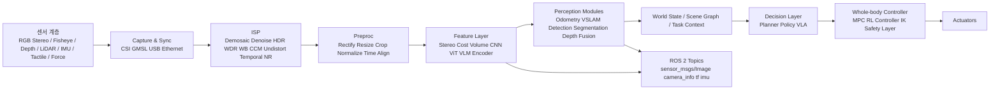
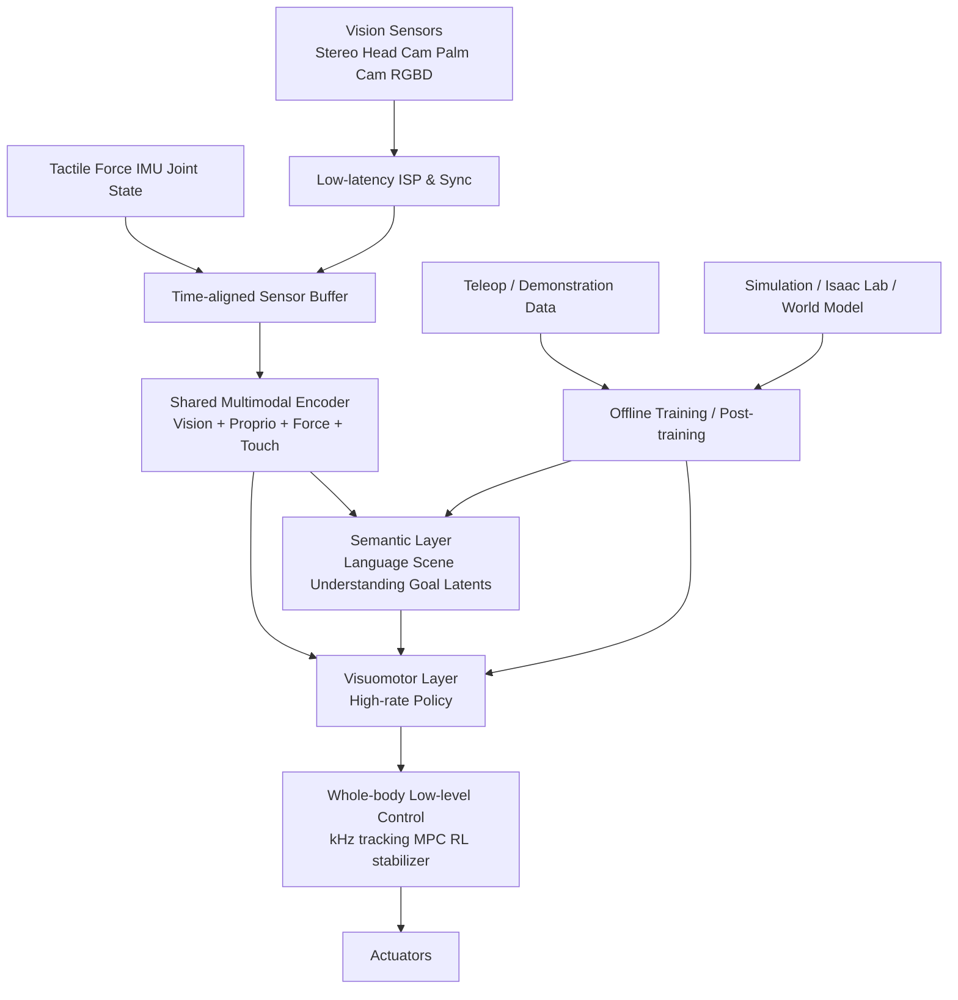

# 로봇용 Perception ISP와 휴머노이드 VLA E2E 스택 동향 보고서

## Executive Summary

최근 5년의 흐름을 한 문장으로 요약하면, **로봇용 카메라 파이프라인은 “보기 좋은 영상” 중심 ISP에서 “행동에 유리한 표현” 중심 ISP로 이동하고 있고, 휴머노이드의 상위 스택은 전통적 모듈식 perception에서 VLA 또는 유사 E2E 구조로 빠르게 재편**되고 있습니다. 연구 쪽에서는 ISP를 객체검출·분할 같은 다운스트림 과업에 맞춰 재구성하거나 학습시키는 흐름이 뚜렷해졌고, 산업 쪽에서는 NVIDIA Argus/SIPL, Qualcomm RB5/RB6, Ambarella CVflow, Sony IMX500처럼 **멀티카메라 동기화·HDR/WDR·저지연·온디바이스 AI**를 한 패키지로 제공하는 방향이 강화되고 있습니다. citeturn30view0turn30view1turn31view0turn31view2turn31view3turn31view4turn31view5turn31view6turn31view7turn36view1turn36view4

휴머노이드 사례를 보면, 공개 정보가 가장 구체적인 쪽은 Figure의 Helix/Helix 02, 1X의 Redwood/NEO, Boston Dynamics Atlas MTS 계열입니다. Figure는 **System 2 의미추론 + System 1 visuomotor + System 0 whole-body control**로 계층화했고, Helix 02에서 “all sensors in, all actuators out”를 공개적으로 선언했습니다. 1X는 **Redwood AI를 온보드 임베디드 GPU에서 실행**하고, NEO에 **Dual 8.85MP 90Hz stereo fisheye**와 Jetson Thor를 탑재했으며, Boston Dynamics는 Atlas MTS에서 **헤드 장착 HDR stereo pair + proprioception + language-conditioned 450M policy**와 30 Hz 이미지 입력을 공개했습니다. citeturn23view0turn23view2turn39view0turn22view0turn22view1turn22view2turn28view0

반면 Tesla Optimus, Apptronik Apollo, Agility Digit는 **대외 공개 수준이 센서 개수·해상도·정확한 ISP 블록·미들웨어 계층까지 내려오지 않는 경우가 많다**는 점이 중요합니다. Tesla는 Optimus에 대해 balance/navigation/perception/interaction software stack을 공개적으로 언급하지만, 로봇 자체의 센서 수·ISP 구성은 현재 공개 범위가 제한적입니다. Apptronik은 Apollo의 **head perception camera, torso sensors, onboard Jetson AGX Orin / Orin NX, GR00T 연동**을 공개했고, Agility는 Digit의 **LiDAR·stereo cameras·VR 기반 LfD·Isaac Sim/Lab·onboard/offboard software**를 공개하지만 역시 세부 ISP는 비공개입니다. 따라서 실제 설계 비교에서는 공개 스펙이 아니라 “**어디까지 온보드에서 닫힌 루프로 처리하느냐**”, “**멀티센서 동기화와 캘리브레이션을 어떻게 유지하느냐**”, “**VLA가 저수준 제어까지 직접 먹느냐 아니면 learned low-level controller 위에 얹히느냐**”가 더 실질적인 비교축입니다. citeturn25view0turn16search0turn16search1turn24view0turn24view1turn24view2turn24view3

실무적으로는, 휴머노이드용 vision stack을 설계할 때 **카메라 수를 늘리는 것보다 센서 동기화, HDR/WDR, geometric calibration, zero-copy transport, 시간정합된 proprioception/force/tactile fusion, low-latency inference budget**을 먼저 고정하는 편이 성공 확률이 높습니다. 특히 공개된 최신 사례들은 공통적으로 **온보드 추론, 시뮬레이션 기반 학습, teleoperation/demo 데이터 파이프라인, 그리고 필요 시 원격 감독**을 함께 씁니다. citeturn30view0turn22view2turn24view2turn28view0turn39view0

## Perception ISP 기술 동향

### 왜 로봇에서 ISP가 다시 중요해졌는가

전통적 ISP는 demosaic, denoise, white balance, color correction, tone mapping, sharpening 같은 단계로 RAW를 사람이 보기 좋은 RGB로 바꾸는 데 최적화되어 왔습니다. 그런데 최근 연구는 이런 파이프라인이 다운스트림 perception에는 반드시 최적이 아니며, 오히려 정보 손실이나 왜곡을 유발할 수 있다고 지적합니다. 2024년 NeurIPS 논문은 detection 보상을 이용해 ISP 모듈과 파라미터를 학습적으로 선택하는 adaptive ISP를 제안했고, 2026년 UniISP는 **human vision과 machine vision을 동시에 만족하는 경량 end-to-end ISP**를 제안했습니다. 2025년 Dark-ISP는 저조도 객체검출을 위해 Bayer RAW에 직접 개입하는 lightweight ISP plugin을 제안했습니다. 즉, 최근의 핵심 방향은 “RAW→예쁜 RGB”가 아니라 “RAW→작업에 유리한 표현”입니다. citeturn36view1turn36view4turn14search9turn14search17

또 하나의 흐름은 **ISP와 perception accelerator의 물리적 통합**입니다. NVIDIA Argus는 Jetson의 dedicated hardware engine으로 ISP를 돌리며 AWB, AE, noise reduction, multi-camera synchronization, 100us 이하 jitter timestamping을 제공하고, CSI/GMSL에서 받은 RAW를 GPU 가속 메모리로 직접 넘깁니다. Qualcomm QRB5165/RB5는 Spectra 480 ISP로 2 Gigapixels/s 처리와 최대 7개 동시 카메라를, RB6는 7 concurrent cameras 또는 24 simultaneous video streams까지를 전면에 내세웁니다. Ambarella는 CVflow 계열에서 HDR, dewarping, EIS, MCTF, stereo processing, visual odometry/SLAM 한정 지원을 묶어 매우 낮은 전력에서 image processing과 CV를 통합하고, Sony IMX500은 아예 센서 내부에서 image + AI inference를 수행합니다. citeturn30view0turn30view1turn31view0turn31view2turn31view3turn31view4turn31view5turn31view6turn31view7

### 주요 ISP 실리콘과 오픈 스택 비교

| 플랫폼 | 공개된 센서/ISP 능력 | 로봇 관점 강점 | 한계 또는 주의점 | 근거 |
|---|---|---|---|---|
| NVIDIA Jetson + Argus | CSI/GMSL 입력, HW ISP, AWB/AE/noise reduction, multi-camera sync, timestamp jitter < 100us, zero-copy GPU 경로 | 저지연·멀티카메라·ROS 2 연계에 강함. perception 그래프 전체를 GPU 가속으로 닫기 쉬움 | ISP 알고리즘 세부 품질 튜닝은 벤더 종속성이 큼 | citeturn30view0turn30view1 |
| Qualcomm QRB5165 / RB5 | Spectra 480 ISP, 2 Gigapixels/s, 8K/4K HDR, 최대 7 동시 카메라, ToF 지원 | 저전력·모바일/로봇 통합 SoC에 적합 | ROS/오픈 생태계 결합은 NVIDIA 대비 약한 편 | citeturn31view0turn31view2 |
| Qualcomm RB6 | 최대 7 concurrent cameras / 24 simultaneous streams, 70–200 TOPS | 다카메라 감시·주행·원격운용에 유리 | 실제 로봇 제품에서의 카메라 구성이 문서대로 다 구현되진 않음 | citeturn31view3 |
| Ambarella CV7/CV5S/CV2S/CV22S | 8K/4K image processing + CVflow, HDR, dewarping, EIS, MCTF, stereo, VO/SLAM 지원, 일부 제품 3W~4W급 | 전력대비 성능이 우수하고 카메라-우선 edge robot에 적합 | 범용 로봇 컴퓨트보단 카메라/비전 SoC 성격이 강함 | citeturn31view4turn31view5 |
| Sony IMX500 / Intelligent Vision Sensor | 센서 내부 image + AI processing, on-chip DSP/SRAM, 데이터 전송량·지연·전력 감소 | 센서 레벨에서 ROI/이벤트/프라이버시 최적화 가능 | 범용 VLA backbone을 센서만으로 대체할 수는 없음 | citeturn31view6turn31view7 |
| libcamera | Linux용 오픈 카메라 스택, HW image processing 제어부를 오픈 친화적으로 다룸 | 커스텀 임베디드 카메라 bring-up과 장기 유지보수에 유리 | 실사용 품질은 실제 ISP 하드웨어와 vendor IPA에 좌우 | citeturn32view0 |
| ROS image_pipeline | raw 이미지에서 상위 비전 처리 사이의 공백을 채우는 표준 파이프라인 | ROS 2 기반 모듈화·교체가 쉬움 | ISP 자체가 아니라 post-ISP image proc 계층 | citeturn32view1 |
| RealSense ROS | RGBD/IMU/TF/metadata/topic, align_depth, temporal/spatial filters, HDR support | RGB-D 로봇의 실전 통합성이 높음 | USB 기반 대역폭·동기화·장착 안정성 고려 필요 | citeturn35view0turn35view1turn35view2 |
| OpenVLA / LeRobot / GR00T | OpenVLA는 1B–34B 학습 확장, LeRobot은 hardware-agnostic interface와 dataset format, GR00T N1.7은 open humanoid VLA | 상위 VLA 실험과 embodiment 이전에 유리 | 실제 휴머노이드 제품에 바로 넣으려면 perception/latency/safety 재구성이 필요 | citeturn32view3turn32view4turn30view4 |

### 실무 관점에서 읽어야 할 핵심 변화

로봇용 ISP의 현재 방향은 세 가지로 요약됩니다. 첫째, **멀티카메라와 이종 센서가 기본값**이 되면서 frame sync와 timestamp integrity가 ISP 수준 요구사항이 되었습니다. 둘째, **HDR/WDR, low-light, temporal denoise, geometric undistort**가 이제는 “영상 품질 옵션”이 아니라 detection/SLAM/teleop 안정성의 일부가 되었습니다. 셋째, 상위 모델이 VLA로 바뀌더라도 **capture→ISP→time sync→calibration→feature transport** 계층은 사라지지 않고 오히려 더 중요해졌습니다. 최신 공개 휴머노이드 스택들이 “all sensors in”을 말하면서도, 실제로는 그 입력이 잘 동기화되고 캘리브레이션된 상태여야만 E2E가 성립하기 때문입니다. citeturn30view0turn31view4turn31view5turn23view2turn39view0

## 휴머노이드 플랫폼별 사례 비교

### 사례 비교 표

| 로봇/플랫폼 | 용도 | 센서 목록 | ISP 구성 | E2E / VLA 비전 스택 | 데이터 흐름·인터페이스 | 처리 분배 | 성능 지표 | 장단점 및 설계 고려사항 | 근거 |
|---|---|---|---|---|---|---|---|---|---|
| **Boston Dynamics Atlas / Atlas MTS** | 산업용 휴머노이드 / 연구 | 헤드 장착 **HDR stereo camera 2개**, force/proprioception, kinematic odometry. 해상도 미지정, 정책 입력 이미지 30 Hz. 일부 데모에선 vision + force + proprioception을 함께 사용 | 로봇 레벨 ISP 세부는 **미지정**. 다만 Atlas에 LG Innotek의 차세대 vision sensing component를 도입 중이며, Jetson Thor 채택 방향 공개 | fixture/bin detection → keypoint localization → kinematic odometry fusion → grasp/object-state estimation. LBM 계열 450M Diffusion Transformer policy가 images + proprioception + language conditioning, action chunk 예측 | 대외 공개 인터페이스는 제한적. Atlas 내부 미들웨어는 사실상 proprietary. 학습용 teleop는 VR 기반 | 온보드 추론 + Isaac Lab/Jetson Thor 기반 강화학습/학습 인프라 | 일부 작업에서 inference-time 1.5x–2x speedup 가능. 이미지 30 Hz | 장점: perception과 whole-body behavior 결합이 가장 성숙한 공개 사례 중 하나. 단점: 정확한 카메라 해상도, ISP 단계, DDS/ROS 공개 부족 | citeturn6view0turn6view1turn6view2turn28view0turn33view0 |
| **Agility Digit** | 물류·제조용 휴머노이드 | multiple cameras + LiDAR, 360° awareness, outdoor use 시 GPS + lidar + stereo cameras. camera 수/해상도/fps 미지정. LfD 시 camera feeds + joint positions + force readings + end-effector location 수집 | 세부 ISP는 **미지정**. NVIDIA AI acceleration platform 기반 실시간 perception 언급 | full-stack autonomy. outdoor navigation에서 GPS waypoint + lidar obstacle detection + stereo terrain mapping. LfD(VR) + RL(sim) 혼합 | Arc 클라우드 플랫폼, 내부 stack은 proprietary. onboard + offboard software 함께 사용 | 온보드 실시간 perception + 오프보드/클라우드 sim training | 정량 지표는 미공개. “fraction of a second” 반응, AI central control, sim-to-real 강화 공개 | 장점: 상용 현장 배치가 가장 앞선 편. 단점: 카메라 세부스펙, ISP, 메시지 버스 정보가 거의 비공개 | citeturn24view0turn24view1turn24view2turn24view3turn7search6 |
| **Figure 02 / 03 + Helix / Helix 02** | 가정·물류용 범용 휴머노이드 | 초기 Helix는 **stereo head cameras** 사용. Helix 02는 head cameras + palm cameras + fingertip tactile sensors + full-body proprioception. palm camera 수는 미지정, tactile 수는 fingertip 전수로 보이지만 정확한 개수는 미지정 | ISP 세부는 **미지정**. 다만 “entirely onboard embedded low-power GPUs” 실행 공개 | Helix: S2(semantic reasoning) + S1(visuo-motor). Helix 02: S0(whole-body foundation control) + S1(all sensors→all actuators) + S2(scene/language). logistics에선 stereo backbone, memory, state history, force feedback 통합 | 내부 인터페이스는 proprietary. 공개상 ROS/DDS 언급 없음 | 완전 온보드 추론. 데이터 확장·후학습은 오프라인 demo 기반 | 4분 61-action dishwasher task, logistics 4.05 s/package, barcode 약 95%, 60h demo로 6.84→4.31 s/package 및 88.2→94.4% | 장점: 현재 공개된 “pixels-to-whole-body” 사례 중 가장 공격적. 단점: ISP, camera intrinsics, 안전계층 공개 부족 | citeturn23view0turn23view1turn23view2turn39view0 |
| **1X NEO / NEO Gamma + Redwood** | 가정용 휴머노이드 | **Dual 8.85MP 90Hz stereo fisheye**, 4 beamforming microphones, linkwise differential IMUs. Redwood Mobility는 stair mode에서 stereo RGB 기반 depth 추정 사용, ToF/LiDAR 비사용 공개 | NVIDIA Argus 사용을 공개. 정확한 demosaic/denoise/HDR 옵션은 **미지정**. Jetson Thor 기반 | Redwood는 vision-language transformer로 end-to-end mobile manipulation. real-world episodes + autonomous data + world model. “runs fully onboard” 공개 | mobile app, remote control, VR device, WiFi/Bluetooth/5G. 외부 공개 인터페이스는 proprietary | 클라우드(B200 학습) + 시뮬레이션(Isaac Sim/Lab) + 온보드(Thor 추론) | 온보드 AI compute 최대 2070 FP4 TFLOPS, 4h runtime | 장점: 공개 정보가 매우 구체적이며 home robot 조건에 맞춰 stereo+onboard design이 명확. 단점: tactile/force sensing의 공개 수준은 Figure보다 적음 | citeturn22view0turn22view1turn22view2turn15search9 |
| **Apptronik Apollo** | 물류·제조 중심 범용 휴머노이드 | head perception camera 1, torso sensors로 360° environment mapping. camera/LiDAR 개수, 해상도, fps는 미지정 | 세부 ISP는 **미지정**. 다만 onboard compute로 Jetson AGX Orin + Orin NX 사용 공개 | GR00T 연동. text/video/human demonstrations를 task prompt로 받아 environment를 인식하고 액션 생성 | 대외 공개 인터페이스는 미지정, 사실상 proprietary | 온보드 AI + 오프보드 학습/시연 데이터 수집 | 정량 latency/power/model size 미지정 | 장점: compute platform 공개가 비교적 명확. 단점: 실제 perception stack과 camera spec 공개 부족 | citeturn16search0turn16search1turn16search2 |
| **Unitree H1-2** | 범용/연구용 휴머노이드 | 3D LiDAR + depth camera. H1-2 head depth camera는 D435. 해상도/fps는 로봇 문서 기준 미지정 | Unitree 로봇 문서 기준 ISP 미지정. D435는 active stereo depth camera이며 sensor-level processing 존재 | 현재 공개 범위는 classical depth+LiDAR perception 중심. 상위 VLA는 별도 G1-D/embodied model 쪽에서 더 강하게 나옴 | Unitree SDK 및 자체 문서/앱. ROS 공개는 제한적 | 온보드 처리 중심, 상위 학습은 별도 플랫폼 | 정량 지표 공개 부족 | 장점: depth+LiDAR 조합이 명확. 단점: perception→policy 전체 경로 공개가 얕음 | citeturn20search1turn20search4turn29search3turn19search0 |
| **Unitree G1 / G1-D** | 연구·개발·embodied AI 플랫폼 | G1 문서 기준 depth camera + 3D LiDAR + 4 microphone array. 중국어 문서 기준 head D435i. 정확한 camera count·RGB resolution은 로봇 공개 문서상 미지정 | D435i 계열 사용으로 볼 때 depth sensor-level processing + optional post-processing 가능. 로봇 전체 ISP는 **미지정** | G1-D는 **UnifoLM-WMA-0 world-model-action** 오픈 아키텍처와 data/training platform을 전면에 내세움 | Unitree open source, app, SDK, multimedia service. 완전 표준 ROS 2 여부는 미지정 | 시뮬레이션 평가 + 온보드 실행 혼합 | 정량 지표는 공개 범위 제한 | 장점: open-source embodied AI 경로가 분명. 단점: 카메라/ISP/버스 디테일은 제한적 | citeturn20search0turn20search7turn29search0turn29search1turn29search16turn19search0turn18search7 |
| **Tesla Optimus** | 범용 휴머노이드 | Optimus 자체 센서 수는 공개 문서상 미지정. Tesla는 per-camera networks, video-from-all-cameras BEV networks, vehicle camera suite on-vehicle processing을 공개. 차량은 8 external cameras + cabin camera | 로봇 ISP는 **미지정**. Tesla는 custom inference hardware와 on-vehicle camera processing을 강조 | 공개 문서상 Optimus는 balance/navigation/perception/interaction software stack을 개발 중. VLA/E2E 여부, 최종 stack 세부 미공개 | 완전 proprietary | 온보드 custom AI hardware 중심으로 추정 가능하나 로봇 문서 기준 구체 항목 미공개 | 정량 지표 미공개 | 장점: vision-centric autonomy heritage가 강함. 단점: 로봇인 Optimus의 공개 데이터가 비교표에 넣기에는 가장 희박함 | citeturn25view0turn26view0turn25view2 |

### 공개 스택에서 읽히는 공통 패턴

이 표에서 가장 중요한 공통점은, **성숙한 휴머노이드일수록 perception이 더 이상 독립 모듈이 아니라 “행동을 위한 상태 표현 생성기”로 재정의**되고 있다는 점입니다. Figure는 센서 전체를 S1에 직접 연결했고, 1X는 stereo RGB에서 depth를 예측해 locomotion과 manipulation에 바로 연결하며, Boston Dynamics는 keypoint-based localization과 state estimation을 behavior policy 앞단에 두되 language-conditioned policy로 이어 붙였습니다. 공개 정도는 다르지만, 상용 휴머노이드의 추세선은 분명히 “센서→ISP→표현→행동”의 결합 강화 쪽입니다. citeturn23view2turn22view1turn15search9turn6view0turn28view0

동시에, **완전한 flat E2E보다는 계층형 E2E**가 더 많이 보입니다. Figure의 S0/S1/S2, Boston의 behavior policy 위 MPC/whole-body control, Agility의 AI central control 위 실시간 balance/step recovery, 1X의 Redwood 위 RL locomotion controller가 그 예입니다. 즉, perception과 action은 더 직접적으로 연결되지만, **kHz급 안정화·접촉·안전은 여전히 별도 계층**이 맡는 구성이 현재 상용화 가능성이 가장 높아 보입니다. citeturn23view2turn24view1turn22view2turn28view0

## 아키텍처 관찰과 설계 시사점

### 전통적 모듈식 perception stack

공개된 ROS 2/Isaac 생태계를 기준으로 보면, 여전히 가장 재현 가능한 구조는 아래와 같은 **모듈식 perception graph**입니다. Isaac ROS Argus Camera는 CSI/GMSL→HW ISP→GPU 메모리→perception graph를 zero-copy로 운용하고, ROS image_pipeline은 raw image와 상위 vision 사이 공백을 메우며, realsense-ros는 RGBD/IMU/TF/topic 구조를 표준화합니다. citeturn30view0turn32view1turn35view0turn35view1

이 구조의 장점은 디버깅과 안전 검증이 쉽다는 점입니다. 반대로 단점은 latency와 복잡성이 증가하고, perception module 사이에 중복 표현이 많아지며, 상위 VLA가 필요로 하는 장기 문맥을 공유하기 어렵다는 점입니다. 그래서 최근 상용 휴머노이드는 이 구조를 완전히 버리기보다, **capture/ISP/sync/calibration은 유지하고 feature 이후를 통합**하는 방향을 택하고 있습니다. citeturn30view0turn23view2turn22view2turn39view0

### 최신 휴머노이드형 계층 E2E VLA stack

Figure와 1X, Boston Dynamics 사례를 종합하면, 최신 휴머노이드에 적합한 구조는 아래처럼 보는 것이 가장 정확합니다. **ISP와 저수준 제어는 분리한 채, 중간 perception 모듈 상당수를 latent space 안으로 흡수**하는 방식입니다. citeturn23view2turn22view1turn22view2turn28view0

이 구조의 핵심 trade-off는 명확합니다. **모든 것을 E2E로 묶을수록 일반화와 skill acquisition은 빨라지지만, calibration drift·sensor timing error·카메라 노출 변화·contact instability가 그대로 policy에 흘러들어갑니다.** 그래서 실제 구현에서는 ISP와 sensor synchronization을 “고정밀 인프라”로 다루고, 그 위에 VLA를 얹는 편이 현실적입니다. 이는 Argus의 multi-camera sync와 1X의 low-latency Argus 활용, Figure의 stereo/force/memory 보강, Boston의 state estimation 결합이 모두 같은 결론을 가리킨다는 점에서 상당히 강한 신호입니다. citeturn30view0turn22view2turn39view0turn6view0turn28view0

## 권장 구성과 설계 가이드

### 권장 참조 구성

실무적으로 “로봇에 둘 수 있는 perception ISP”를 목표로 한다면, 현재 가장 무난한 참조 구성은 **멀티카메라 HW ISP + 시간정합된 proprioception/IMU + 선택적 depth/LiDAR + feature-level 통합 encoder + 계층형 policy**입니다. 온보드 기준으로는 Jetson Argus/SIPL 계열이 ROS 2 결합성과 zero-copy 면에서 가장 재현성이 높고, 저전력 카메라-우선 설계라면 Ambarella/Sony 계열이 좋습니다. Qualcomm RB5/RB6는 모바일·저전력·다카메라에서 매력적이지만, 로봇 소프트웨어 생태계 결합성은 프로젝트별 검증이 필요합니다. citeturn30view0turn30view1turn31view2turn31view3turn31view4turn31view6

권장되는 기본 센서 세트는 다음과 같습니다. **헤드 stereo RGB 또는 stereo fisheye 1쌍**은 VLA/teleop/ego-view semantics의 기반이고, **IMU + joint state + hand force/tactile**은 안정적 whole-body control의 기반입니다. depth/LiDAR는 가정용 근거리 조작만 목표라면 생략 가능하지만, 산업용 안전·팔레트·통로·반사물 환경이면 여전히 유리합니다. 1X가 home use에서 stereo-only를 밀고, Figure가 touch/palm camera를 추가하며, Unitree H1-2가 depth+LiDAR를 유지하는 차이는 곧 이 용도 차이를 반영합니다. citeturn22view0turn15search9turn23view2turn20search1turn20search4

### 요약 체크리스트

- **센서 수보다 동기화 정확도부터 고정**한다. 멀티카메라 timestamp jitter, IMU 동기, actuator state time base를 먼저 정의한다. citeturn30view0
- **HDR/WDR와 저조도 성능을 perception KPI와 함께 본다.** 사람이 보기 좋은 영상보다 dark/reflective scene에서 detection·grasp success를 우선 측정한다. citeturn31view5turn14search9turn36view4
- **ISP는 가능한 한 온칩 또는 근접 SoC에서 처리**하고, 이후 feature path는 zero-copy 또는 최소 복사 경로로 묶는다. citeturn30view0turn30view1
- **geometric undistort / rectification / calibration drift 관리**를 ISP만큼 중요하게 다룬다. Figure의 learned visual proprioception도 결국 calibration scalability 문제의 해법입니다. citeturn23view1turn39view0
- **상위 VLA와 저수준 안정화 제어를 분리**한다. 현재 상용 사례는 거의 모두 이런 계층형 구성을 취한다. citeturn23view2turn28view0turn22view1
- **teleop/demo → simulation → post-training → onboard deployment**를 하나의 파이프라인으로 설계한다. 상용 사례 대부분이 이 경로를 택한다. citeturn24view2turn24view1turn22view2turn28view0
- **ROS 2 노출 계층과 내부 proprietary zero-copy 계층을 분리**한다. 외부 통합은 ROS 2가 편하지만, 내부 성능 루프는 별도 경로가 더 현실적이다. citeturn32view1turn35view1turn30view0
- **성능 지표를 perception-only가 아니라 task-level로 잡는다.** 예컨대 package handling time, barcode success, grasp recovery, insertion success, stair traversal robustness 같은 지표가 더 중요하다. citeturn39view0turn6view1

## 참고 우선순위 소스

### 공식 제품 페이지와 기술 문서

가장 우선해서 볼 소스는 NVIDIA Isaac ROS Argus/SIPL 문서, Jetson Thor 페이지, Qualcomm QRB5165/RB5/RB6 페이지, Ambarella AIoT/Industrial & Robotics 페이지, Sony IMX500/Intelligent Vision Sensor 페이지입니다. 이들은 ISP가 어디서 실행되고, 어떤 카메라 동시성·HDR·동기화·accelerator 구성이 가능한지 가장 직접적으로 보여 줍니다. 로봇 사례 쪽에서는 Boston Dynamics Atlas 블로그들, Agility Digit 자율주행·AI 글, Figure Helix/Helix 02, 1X NEO/Redwood/NVIDIA 글, Apptronik Apollo/GR00T 협업 페이지, Unitree H1/G1/G1-D 문서, Tesla AI & Robotics 페이지가 1차 자료입니다. citeturn30view0turn30view1turn8search0turn31view0turn31view2turn31view3turn31view4turn31view6turn31view7turn28view0turn24view0turn23view0turn23view2turn22view0turn22view1turn22view2turn16search1turn20search0turn29search0turn25view0

### 주요 학술 논문

연구 흐름을 추적할 때는 **RT-2**, **Open X-Embodiment / RT-X**, **π0**, **Selective Perception for Robot**, **adaptive/task-aware ISP 계열**, **UniISP** 순서로 보는 것이 좋습니다. RT-2는 VLA 개념을 대중화했고, Open X-Embodiment는 cross-embodiment 데이터 표준을, π0는 flow-matching 기반 generalist control을, Selective Perception은 멀티뷰 VLA의 효율 문제를, adaptive ISP/UniISP는 human ISP와 machine perception의 결합 문제를 각각 대표합니다. citeturn37view0turn37view1turn37view2turn36view5turn36view1turn36view4

### 오픈소스 레포

오픈소스 실험과 재현을 위해서는 **libcamera**, **ros-perception/image_pipeline**, **realsense-ros**, **isaac_ros_argus_camera**, **isaac_ros_sipl_camera**, **OpenVLA**, **LeRobot**, **Isaac GR00T**를 우선 보는 것이 좋습니다. 이 조합이면 카메라 bring-up, post-ISP ROS graph, RGB-D/IMU 표준 topic, Jetson zero-copy, open VLA fine-tuning, dataset/robot abstraction까지 한 번에 커버할 수 있습니다. citeturn32view0turn32view1turn32view2turn12search3turn30view1turn32view3turn32view4turn30view4

## Open questions / limitations

이 보고서는 **공식 공개 문서 중심**으로 정리했기 때문에, 많은 항목이 의도적으로 **“미지정”**으로 남아 있습니다. 특히 Boston Dynamics Atlas, Agility Digit, Apptronik Apollo, Tesla Optimus는 공개 자료가 센서 철학과 compute 방향은 설명하지만, **카메라 정확한 개수·해상도·fps·ISP 단계별 블록·latency budget·전력·DDS/ROS 메시지 스키마**까지는 내려오지 않습니다. Unitree도 G1-D의 world-model-action 방향은 비교적 분명하지만, 로봇별 최종 perception→policy 내부 버스와 ISP 튜닝은 자세히 공개하지 않습니다. 따라서 실제 제품 아키텍처 결정을 위해서는 벤더 NDA 자료, bring-up guide, sensor timing spec, calibration 절차서가 추가로 필요합니다. citeturn33view0turn24view1turn16search1turn25view0turn29search0

또한 Honda ASIMO / HRP 계열은 역사적으로 매우 중요하지만, 본 보고서는 사용자의 요청에 맞춰 **최근 5년 우선** 원칙을 적용했기 때문에 본문 비교표에서는 최근 상용/개발 사례를 우선했습니다. ASIMO/HRP는 “모듈식 perception + 전용 제어”의 역사적 기준선으로는 유효하지만, 현재의 휴머노이드 VLA/E2E 경쟁축과는 시간적 간격이 큽니다. citeturn17search2turn17search13